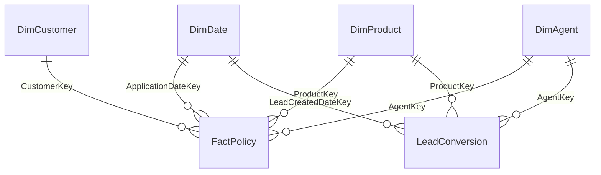

# 01 - Life Insurance Dataset + Data Science Demo Specification

## Purpose

Intha document-ai Codex-ku instruction-aa use pannanum. Goal random dummy rows create pannradhu illa. **Life insurance business-ku believable-a irukkura, relationship correct-a irukkura, Power BI star schema-ku suitable-a irukkura, ML conversion prediction-ku learnable signal irukkura synthetic dataset** generate pannanum.

> Important: Idhu 100% synthetic demo data. Daiichi Life actual customer/policy data illa. Actual Daiichi metrics/values nu represent panna koodadhu.

## Demo Story

1. Customer/lead different channels-la varuvanga.
2. Agent / digital / bancassurance channel moolama product interest create aagum.
3. Application underwriting-ku pogum.
4. Approved application policy-aa issue aagum.
5. Policy active / lapsed / matured / claimed status-ku move aagum.
6. Management premium, policy growth, renewal, lapse, geography, product, agent/channel performance paakanum.
7. Historical leads-ai use panni **next lead convert aaguma?** nu ML model probability predict pannanum.
8. High-propensity leads-ai Power BI-la sales team prioritize panna show pannanum.

---

# A. Source Tables - Exactly 5 Operational + 1 ML Input

## 1. `DimDate`

**Grain:** One row per calendar date.

Required columns:
- DateKey - integer `YYYYMMDD`
- Date
- Year
- Quarter
- QuarterNumber
- MonthNumber
- MonthName
- YearMonth
- WeekOfYear
- DayOfWeek
- DayName
- IsWeekend
- IsMonthEnd
- IsQuarterEnd
- IsYearEnd

Default date range: `2023-01-01` to configurable demo end date.

Why: MTD/QTD/YTD/PY analysis + Calculation Group demo.

## 2. `DimCustomer`

**Grain:** One row per synthetic customer.

Columns:
- CustomerKey
- CustomerID
- Age
- AgeBand: `18-29`, `30-39`, `40-49`, `50-59`, `60+`
- Gender - reporting use only
- OccupationCategory
- IncomeBandSGD
- MaritalStatus
- ExistingCustomerFlag
- CustomerSegment: `Emerging`, `Mass`, `Affluent`, `High Value`
- Region
- PlanningArea
- PostalSector
- PlanningAreaLatitude
- PlanningAreaLongitude
- ConsentForMarketingFlag
- CustomerSinceDate

Singapore synthetic geography examples:
- Central: Toa Payoh, Queenstown, Bukit Merah, Novena, Downtown Core
- East: Tampines, Bedok, Pasir Ris
- North: Woodlands, Yishun, Sembawang
- North-East: Punggol, Sengkang, Hougang
- West: Jurong East, Jurong West, Clementi, Bukit Batok

Latitude/Longitude planning-area centroid level mattum. Exact residential coordinates vendaam.

## 3. `DimProduct`

**Grain:** One row per synthetic product.

Columns:
- ProductKey
- ProductCode
- ProductName
- ProductFamily
- CoverageType
- RiskTier
- MinEntryAge
- MaxEntryAge
- TypicalPremiumBand
- TypicalSumAssuredBand
- InvestmentLinkedFlag
- CriticalIllnessFlag
- ProductActiveFlag
- ProductLaunchDate

ProductFamily:
- Term Life
- Whole Life
- Endowment / Savings
- Investment Linked
- Critical Illness
- Retirement / Annuity

Actual Daiichi product names copy panna koodadhu.

## 4. `DimAgent`

**Grain:** One row per advisor/distribution entity.

Columns:
- AgentKey
- AgentID
- AgentName - synthetic
- DistributionChannel
- BranchName
- Region
- PlanningArea
- BranchLatitude
- BranchLongitude
- AgentJoinDate
- AgentTenureMonths
- AgentGrade: `Associate`, `Senior`, `Premier`
- MonthlyTargetSGD
- ActiveFlag

DistributionChannel:
- Agency
- Bancassurance
- Digital
- Broker / IFA
- Direct

Digital channel-ku synthetic `Digital Team` records use pannalaam.

## 5. `FactPolicy`

**Grain:** One row per issued/historical policy.

Keys:
- PolicyKey
- PolicyID
- CustomerKey
- ProductKey
- AgentKey
- ApplicationDateKey
- IssueDateKey
- RenewalDateKey

Measures/attributes:
- ApplicationDate
- IssueDate
- PolicyStatus
- PaymentFrequency
- UnderwritingDecision
- UnderwritingRiskBand
- DaysToIssue
- AnnualPremiumSGD
- MonthlyEquivalentPremiumSGD
- SumAssuredSGD
- RenewalPremiumDueSGD
- RenewalPremiumPaidSGD
- RenewalPaidFlag
- LapseFlag
- ClaimCount
- ClaimPaidAmountSGD
- ClaimStatus
- PolicyTermYears
- AcquisitionChannel
- LastModifiedDateTime

PolicyStatus:
- Active
- Lapsed
- Matured
- Claimed
- Cancelled

### Mandatory business rules

1. `IssueDate >= ApplicationDate`
2. `RenewalDate > IssueDate`
3. Customer age must fit product entry-age rules.
4. Premium and sum assured must be positive.
5. Higher coverage / age / risk generally increases premium, but with noise.
6. Claims only after policy issue.
7. Claim paid should not exceed sum assured in normal synthetic cases.
8. Lapsed policies should not show future renewal paid.
9. Matured status must fit term/date logic.
10. All foreign keys valid.
11. No duplicate PolicyID.
12. Date keys must exist in DimDate.

---

# B. ML Input Table

## 6. `LeadConversion`

**Grain:** One row per sales lead.

Identity/time:
- LeadID
- LeadCreatedDate
- LeadCreatedDateKey
- ProductKey
- AgentKey

Business features:
- LeadSource
- DistributionChannel
- Region
- PlanningArea
- AgeBand
- IncomeBandSGD
- ExistingCustomerFlag
- ProductInterest
- EstimatedAnnualPremiumSGD
- ContactAttempts
- FirstResponseHours
- FollowUpCount
- DigitalEngagementScore
- NeedsAssessmentScore
- AppointmentCompletedFlag
- QuoteProvidedFlag
- DaysSinceLeadCreated
- LeadStage

LeadSource examples:
- Website
- Referral
- Branch
- Bancassurance
- Campaign
- Agent Prospecting
- Existing Customer Cross-sell

LeadStage:
- New
- Contacted
- Qualified
- Appointment
- Quote
- Application
- Won
- Lost

Historical target:
- ConvertedFlag
- ConversionDate
- LostReason

Notebook-generated output:
- ConversionProbability
- PredictedConvertedFlag
- PropensityBand: `High`, `Medium`, `Low`
- ModelVersion
- ScoredAt

## ML signal rules

Positive signals should include:
- Existing customer
- Appointment completed
- Quote provided
- High needs-assessment score
- Fast response
- Healthy follow-up pattern
- Better digital engagement
- Experienced agent effect
- Referral / cross-sell source

Negative signals:
- Slow first response
- No appointment/quote
- Too many unsuccessful follow-ups
- Premium estimate too high relative to income band
- Lead aging without progression

Noise MUST exist. Perfect deterministic conversion create panna koodadhu.

### Avoid target leakage

Training features-la use panna koodadhu:
- ConversionDate
- LostReason
- Final Won/Lost stage
- PolicyID created after conversion
- Any post-outcome field

### Fairness/governance

ML model default-a use panna koodadhu:
- Gender
- Nationality
- Religion
- Race
- Exact residential location
- MaritalStatus

AgeBand report-la use pannalaam; model-la optional/fairness-reviewed.

---

# C. Relationship Model



Power BI:
- `DimDate -> FactPolicy[ApplicationDateKey]` active.
- Issue/Renewal dates inactive relationships + `USERELATIONSHIP()` or role-playing strategy.
- LeadConversion same Date/Product/Agent dimensions use pannalaam.

---

# D. Data Distribution Requirements

Actual Daiichi metrics imitate panna koodadhu. Demo believable-a irukkanum.

Generator should create:
- Multiple years
- Monthly seasonality
- Product mix differences
- Channel mix differences
- Geography differences
- Agent performance variance
- Premium/sum-assured ranges by product family
- Renewal/lapse behavior
- Small amount of dirty/missing data in RAW layer only
- Clean curated output
- Historical converted/non-converted leads sufficient for classification

Avoid:
- Every month exact 10% growth
- Every agent same conversion
- Every channel same premium
- 99% ML accuracy

---

# E. Scale Design

Hard-code one row count vendaam.

Generator should support:

```text
--scale small
--scale medium
--scale large
```

- small = local validation
- medium = interview live demo
- large = Fabric/incremental-load test

Exact volumes config-la configurable-a irukkanum.

---

# F. Codex Deliverables

```text
insurance-demo/
├─ src/
│  └─ generate_insurance_demo_data.py
├─ config/
│  └─ demo_config.json
├─ data/
│  ├─ raw/
│  └─ curated/
├─ validation/
│  ├─ data_quality_report.md
│  └─ validation_summary.csv
├─ docs/
│  ├─ data_dictionary.md
│  └─ relationship_model.md
└─ README.md
```

Output:
- CSV
- Parquet if possible
- UTF-8
- deterministic random seed

---

# G. Mandatory Validation

Generator finish aana automated checks:

1. Primary key duplicates = 0
2. Orphan foreign keys = 0
3. Invalid date sequence = 0
4. Invalid age/product rule = 0
5. Negative premium/sum assured = 0
6. Invalid claim amount = 0
7. Geography mapping valid
8. Policy status logic valid
9. ML target not extremely imbalanced
10. Leakage fields clearly excluded
11. Every month represented
12. All product families/channels represented
13. Map fields available
14. Currency fields numeric
15. `LastModifiedDateTime` available for incremental-load demo

Validation fail aana generator success nu finish panna koodadhu.

---

# H. ML Notebook Expected Flow

Fabric Notebook:

1. Lakehouse LeadConversion load
2. Completed historical leads filter
3. Leakage columns remove
4. Prefer time-based train/test split
5. Missing values + categorical encoding
6. Baseline Logistic Regression
7. Compare Random Forest / LightGBM if reliable
8. Metrics: ROC-AUC, Precision, Recall, F1, Confusion Matrix
9. MLflow experiment log
10. Best model register
11. Current open leads score
12. Prediction output Delta table-ku save
13. High/Medium/Low propensity band
14. Power BI Direct Lake-la consume

Interview line:

> "I am not using AI just for decoration. Historical lead behaviour is converted into a propensity score, the scored leads are written back to the Lakehouse, and Power BI uses that output to help the sales team prioritize the most promising leads."

---

# I. Final Acceptance Criteria

- Business story understandable
- Star schema clean
- Referential integrity pass
- Map/date analysis works
- ML beats random baseline meaningfully without leakage
- High-propensity output actionable
- No real PII
- No claim that synthetic metrics represent Daiichi actual business
