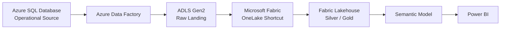
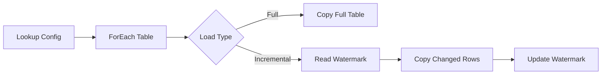

# 02 - Azure Foundation Guide for Life Insurance Fabric Demo

## Goal

Azure-ai full analytics platform madhiri overbuild panna vendam. Interview demo-ku clear flow pothum:

**Operational Source -> Azure Landing -> Microsoft Fabric -> Power BI**

JD-la direct-a irukkura Azure items:
- Azure SQL
- ADF
- Blob / ADLS storage

So demo-la minimum visible architecture:
1. Resource Group
2. Azure SQL Database
3. ADLS Gen2
4. Azure Data Factory
5. Secure connection concept

---

# Target Architecture



### Why this design?
- Azure SQL = operational app/source simulation
- ADF = ingestion/orchestration demonstrate pannum
- ADLS = governed raw landing
- Fabric Shortcut = unnecessary duplicate copy avoid pannum
- Fabric = transformation + ML + serving
- Power BI = business consumption

---

# Step 1 - Resource Group

Create:

`rg-insurance-fabric-demo`

### Ena panrom?
All demo Azure resources one logical container-kulla group panrom.

### Ean?
- Easy management
- Easy cost tracking
- Easy cleanup after interview
- Enterprise hygiene show pannum

---

# Step 2 - ADLS Gen2 Storage

Storage account example:

`stinsurancedemo<unique>`

Enable:
- Hierarchical Namespace = ON

Containers:

```text
raw
archive
control
```

Folder design:

```text
raw/
  dimdate/
  dimcustomer/
  dimproduct/
  dimagent/
  factpolicy/
  leadconversion/

archive/
control/
```

### Ena panrom?
Raw source data Azure storage-la land panrom.

### Ean?
- Source system and analytics system decouple aagum
- Historical raw copy retain panna mudiyum
- Reprocessing easy
- Fabric Shortcut-ku clean source
- JD-la ADLS knowledge demonstrate pannum

Preferred format:
- Parquet
- CSV only for easy manual inspection

---

# Step 3 - Azure SQL Database

Operational source simulate panna use pannunga.

Suggested tables:

```text
dbo.DimDate
dbo.DimCustomer
dbo.DimProduct
dbo.DimAgent
dbo.FactPolicy
dbo.LeadConversion
```

FactPolicy and LeadConversion-la:
- `LastModifiedDateTime` mandatory

### Ena panrom?
Synthetic life insurance source data SQL database-la host panrom.

### Ean?
Interview-la realistic-a:

> "Assume CRM/policy administration source data Azure SQL-la irukku."

nu architecture explain panna mudiyum.

---

# Step 4 - Azure Data Factory

Create ADF:

`adf-insurance-fabric-demo`

Linked Services:
1. Azure SQL Database
2. ADLS Gen2

Authentication:
- Demo-ku secure/easy option
- Production discussion-la Managed Identity / Key Vault / Private Endpoint mention pannanum
- Password hard-code panna koodadhu

---

# Step 5 - ADF Pipeline

Pipeline name:

`PL_AzureSQL_To_ADLS_Raw`

Dimensions:
- Full load acceptable

Large facts:
- Incremental load

Suggested parameters:

```text
TableName
SourceSchema
WatermarkColumn
SinkFolder
LoadType
```

Flow:



### Ena panrom?
Azure SQL data ADLS raw layer-ku controlled pipeline-la move panrom.

### Ean?
- Repeatability
- Incremental ingestion
- Monitoring
- Failure visibility
- Source/landing separation
- ADF skill visible-a demonstrate pannum

---

# Step 6 - Incremental / Watermark Pattern

Control table/file:

```text
TableName | LastSuccessfulWatermark
FactPolicy | 2026-09-25T10:30:00
LeadConversion | 2026-09-25T10:30:00
```

Next run logic:

```sql
WHERE LastModifiedDateTime > @PreviousWatermark
  AND LastModifiedDateTime <= @CurrentWatermark
```

### Ean?
Large tables-ku every run full copy waste.

Interview line:

> "For high-volume transactional tables I would use watermark/CDC-based incremental ingestion, while small dimensions can stay full-refresh when that is operationally simpler."

---

# Step 7 - Validation

ADF run apram check:
- Source count
- Sink count
- File generated
- Incremental second run only changed rows process pannutha?
- Schema correct-a?
- Pipeline failure details visible-a?

Create control log:

```text
PipelineRunId
TableName
StartTime
EndTime
RowsRead
RowsWritten
Status
WatermarkFrom
WatermarkTo
```

---

# Step 8 - Azure -> Fabric Integration

## Preferred Demo Path: OneLake Shortcut

ADLS raw folder-ai Fabric Lakehouse-kulla Shortcut create pannunga.

### Ean preferred?
- Same data duplicate copy panna vendam
- Faster onboarding
- Federated architecture concept show pannum
- OneLake strength visible-a irukkum

## Alternative: Fabric Data Factory Copy

Use when:
- Physical copy needed
- Schema conversion needed
- Upsert/CDC Fabric side-la manage pannanum
- Source availability independent copy venum

---

# Step 9 - Security Talking Points

Demo-la full enterprise network implementation panna vendam. But explain panna theriyanum:

- Microsoft Entra ID
- Managed Identity
- Azure Key Vault
- RBAC / ACL
- Private Endpoint
- Network isolation
- Least privilege
- Audit/monitoring

Financial-services context-na security architecture mention important.

---

# Step 10 - Demo Cost Control

- Small Azure SQL tier use pannunga
- ADF pipeline repeated unnecessary run avoid
- Large dataset final test-ku mattum
- Interview mudinja unused resources stop/delete
- Resource Group-level cleanup use pannunga

---

# Live Interview-la Azure Part Show Panna Order

Maximum 1-2 minutes:

1. Resource Group
2. Azure SQL tables
3. ADF pipeline canvas
4. Successful run
5. ADLS raw files
6. Fabric-ku move

Main sentence:

> "Azure is my operational/source and landing layer. I use ADF for controlled ingestion into ADLS, then Fabric consumes that data through OneLake Shortcut or managed ingestion depending on the requirement."

---

# Demo vs Production

## Demo
- Small data
- Simple connectivity
- Single DEV path
- Minimal network setup

## Production
- Private endpoints
- Managed identity
- Key Vault
- Dev/Test/Prod
- Monitoring/alerts
- CI/CD
- Data classification
- Security review
- Cost/capacity planning

Demo limitation transparent-a sollunga. Adhu maturity-a theriyum.
