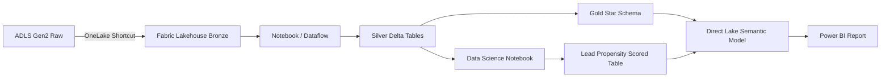
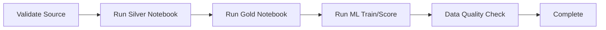

# 03 - Microsoft Fabric Implementation Guide

## Goal

Azure-la source/landing ready aana apram **Fabric dhaan analytics ground**.

Demo flow:

**ADLS / Azure SQL -> OneLake -> Lakehouse -> Transform -> ML -> Gold Tables -> Direct Lake Semantic Model -> Power BI**

JD-la cover panna vendiya items:
- Fabric Lakehouse
- Fabric Warehouse
- Data Factory
- OneLake
- Power BI
- Azure integration

---

# Public Daiichi Context - Why This Demo Direction Makes Sense

Public Microsoft customer story padi Daiichi Life Group:

- `FDA - Federated Data Architecture` build pannirukku
- Microsoft Fabric use pannirukku
- OneLake Shortcuts moolama data-ai virtual-a integrate pannra approach use pannirukku
- Managed Private Endpoints and OAP security capabilities evaluate/use pannirukku
- Feb 2026-la Power BI first visualization use case deliver pannirukku
- Microsoft Purview data catalog add pannirukku
- 20+ analytics use cases identify pannirukku
- FDA mela `ASPIRE` AI platform direction build pannitu irukku

Important:
**Idhu Daiichi Group public architecture. Singapore entity / exact interview project same implementation nu assume panna koodadhu.**

Public source:
`https://www.microsoft.com/ja-jp/customers/story/26591-daiichi-life-group-microsoft-fabric`

---

# Recommended Fabric Architecture



---

# Step 1 - Create DEV Workspace

Suggested:

`Insurance_Fabric_Demo_DEV`

If trial allows later:
- `Insurance_Fabric_Demo_TEST`
- `Insurance_Fabric_Demo_PROD`

### Ean?
Workspace boundary:
- access
- ownership
- lifecycle
- deployment
- environment separation

---

# Step 2 - Create Lakehouse

Name:

`lh_insurance_demo`

Structure:

```text
Files/
  shortcut_raw/

Tables/
  silver_*
  gold_*
```

### Ean Lakehouse?
- Files + tables same platform
- Delta table support
- Notebook friendly
- Data Science friendly
- Direct Lake integration

---

# Step 3 - Create OneLake Shortcut to ADLS

ADLS raw container/folder -> Lakehouse Shortcut.

### Ena panrom?
ADLS-la already irukkura data-ai Fabric-la physical duplicate copy pannama access panrom.

### Ean?
- Duplicate data reduce
- Faster onboarding
- Source ownership retain
- Federated architecture concept
- Daiichi public FDA story-oda conceptually relevant

Interview line:

> "If data is already governed in ADLS, I would first evaluate a OneLake Shortcut rather than immediately creating another physical copy. If transformation, retention or performance requires materialization, then I would persist curated Delta tables in Fabric."

---

# Step 4 - Bronze Layer

Bronze = raw representation.

Approach:
- Shortcut itself Bronze source-a irukkalaam
- Business meaning change panna koodadhu
- Original columns retain
- Metadata add pannalaam

Metadata:
- SourceSystem
- LoadDateTime
- BatchID
- FileName if applicable

### Ean?
Traceability + replay + source comparison.

---

# Step 5 - Silver Layer

Fabric Notebook:

`NB_Transform_Insurance_Silver`

Tasks:
1. Raw/shortcut data read
2. Column names standardize
3. Data types fix
4. Trim/clean text
5. Business key dedupe
6. Foreign key validation
7. Null handling
8. Date validation
9. Data quality flags
10. Write Delta tables

Output:

```text
silver_dim_date
silver_dim_customer
silver_dim_product
silver_dim_agent
silver_fact_policy
silver_lead_conversion
```

### Ean?
Raw data direct report-ku connect panna koodadhu. Silver = trusted standardized layer.

---

# Step 6 - Gold Layer

Gold = Power BI optimized serving layer.

Output:

```text
gold_dim_date
gold_dim_customer
gold_dim_product
gold_dim_agent
gold_fact_policy
gold_lead_conversion
```

### Ean?
- Semantic model simple-a irukkum
- Business naming clean-a irukkum
- Unnecessary raw columns remove panna mudiyum
- Report developers-ku trusted model

---

# Step 7 - Fabric Data Factory Pipeline

Create:

`PL_Insurance_EndToEnd`

Flow:



If Azure SQL direct ingestion choose pannina first stage-la Copy Activity add pannalaam.

### Ean?
Manual notebook run production pattern illa.

Pipeline gives:
- repeatability
- scheduling
- dependency management
- failure handling
- monitoring

---

# Step 8 - Data Science / Lead Conversion Prediction

## Recommended Approach

**Fabric Data Science Notebook + MLflow**

Unga use case-ku notebook dhaan best.

Reason:
- Data already Lakehouse-la irukku
- Python/Spark available
- MLflow native integration
- Prediction output same Lakehouse-ku write panna easy
- Power BI Direct Lake consume panna easy

Notebook name:

`NB_Lead_Conversion_Model`

Flow:
1. `silver_lead_conversion` load
2. Completed historical leads filter
3. Leakage fields remove
4. Prefer time-based train/test split
5. Missing values handle
6. Categorical encoding
7. Baseline Logistic Regression
8. Compare Random Forest / LightGBM if reliable
9. Metrics log
10. Best model MLflow register
11. Open/current leads score
12. Save `gold_lead_propensity`

Output columns:
- LeadID
- ConversionProbability
- PredictedConvertedFlag
- PropensityBand
- ModelVersion
- ScoredAt

Metrics:
- ROC-AUC
- Precision
- Recall
- F1
- Confusion Matrix

Interview benefit:
Power BI Developer role-ku report mattum illa; ingestion -> transformation -> ML enrichment -> BI full chain show pannum.

---

# Step 9 - Semantic Model

Gold Lakehouse tables-la semantic model create pannunga.

Preferred mode:
**Direct Lake**

### Ean?
- OneLake Delta data direct-a use
- Import duplication reduce
- Fabric-native architecture demonstrate
- Fast interactive Power BI analytics

Relationships:

```text
DimDate 1-* FactPolicy
DimCustomer 1-* FactPolicy
DimProduct 1-* FactPolicy
DimAgent 1-* FactPolicy

DimDate 1-* Lead/Propensity
DimProduct 1-* Lead/Propensity
DimAgent 1-* Lead/Propensity
```

Core measures:
- Total Policies
- Active Policies
- Annual Premium
- Avg Premium
- Total Sum Assured
- Renewal Rate
- Lapse Rate
- Claim Rate
- Avg Days to Issue
- Total Leads
- Converted Leads
- Conversion Rate
- High Propensity Leads
- Avg Conversion Probability

---

# Step 10 - Calculation Group

JD explicitly calculation groups mention pannudhu.

Create:

`Time Intelligence`

Items:
- Current
- MTD
- QTD
- YTD
- Previous Month
- Previous Year
- YoY %

Apply to:
- Annual Premium
- Policies
- Leads
- Converted Leads

### Ean?
Same date logic multiple measures-la duplicate panna vendam.

---

# Step 11 - Composite Model Talking Point

Live demo-ku mandatory illa.

Good interview answer:
- Core Fabric fact = Direct Lake
- Small planning/target table = Import if suitable
- Remote semantic/source = DirectQuery only where justified

Composite model use pannradhukaga unnecessary complexity add panna koodadhu.

---

# Step 12 - Dev / Test / Prod

Deployment Pipeline:

```text
Development -> Test -> Production
```

Promote:
- supported Fabric items
- Pipeline
- Notebook
- Semantic Model
- Report

Environment-specific connection/config values rules/parameters-la manage pannanum.

### Ean?
Direct manual DEV-to-PROD overwrite avoid.
Controlled release + testing discipline.

---

# Step 13 - Security / Governance Talking Points

Financial-services context-ku ready-a irukkanum:

- Workspace roles
- Least privilege
- RLS / OLS
- Entra groups
- Sensitivity labels
- Data lineage
- Purview catalog
- Private endpoints
- OAP concept
- Audit/monitoring

Demo-la ellathayum configure panna vendam. At least lineage + permissions concept show pannunga.

---

# Step 14 - Warehouse - Eppo Use Pannanum?

## Lakehouse choose when:
- Spark/notebook
- Data Science
- files + tables
- Delta
- engineering flexibility

## Warehouse choose when:
- SQL-first team
- relational warehouse workload
- T-SQL-centric transformations
- governed BI serving layer

### Intha demo
Lakehouse primary because ML/notebook flow irukku.

Optional bonus:
Gold relational tables-ai Fabric Warehouse-la expose/replicate panna architecture discussion mattum ready-a irunga. Live demo mandatory illa.

---

# Step 15 - Monitoring

Show:
- Pipeline run history
- Notebook success
- Row counts
- Data quality result
- Semantic model connectivity

Production talking point:
- failure notification
- retries
- capacity monitoring
- query optimization
- SLA

---

# Final Fabric Demo Flow

Interview-la 2-3 minutes platform demo:

1. Workspace
2. Lakehouse
3. ADLS Shortcut
4. Pipeline
5. Silver/Gold Notebook
6. ML Notebook prediction result
7. Direct Lake Semantic Model
8. Power BI Report
9. Deployment Pipeline view

Main sentence:

> "I separated the solution into source/landing, governed Fabric transformation, ML enrichment, semantic model, and business consumption. I used a OneLake Shortcut where copying was unnecessary, Delta Gold tables for trusted analytics, and Direct Lake for Power BI."

---

# Do Not Do

- Actual Daiichi data nu pretend panna koodadhu
- Too many Fabric features force panna koodadhu
- Notebook-la 200 lines live explain panna koodadhu
- Azure + Fabric same data-movement job duplicate pannitu architecture confuse panna koodadhu
- Production security configure panniten nu false claim panna koodadhu
- ML score unrealistic 99% accuracy nu show panna koodadhu
