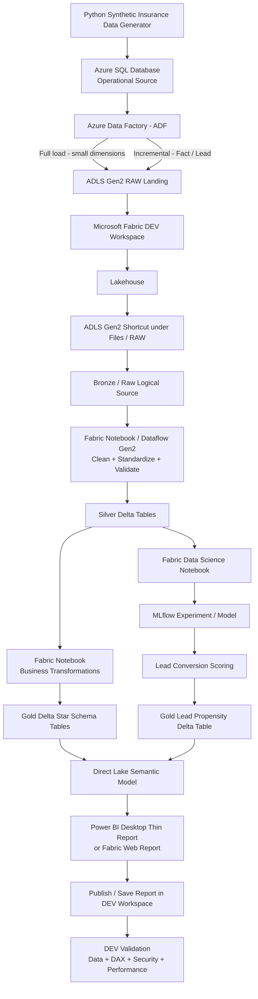
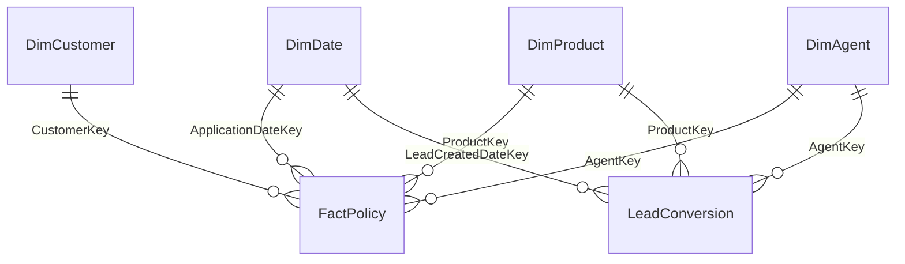
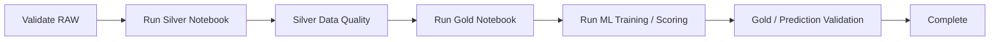
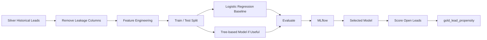

# Daiichi Life Interview Demo – Corrected Azure → Microsoft Fabric → Power BI End-to-End Flow

> **Purpose**  
> Intha document-la namma Azure → Fabric → Power BI demo architecture-ai correct sequence-la update pannirukom.  
> Inga **data/runtime flow** and **DEV → TEST → PROD deployment flow** rendu separate-aa irukkum.  
> Idhu full synthetic life-insurance demo; actual Daiichi customer/production data illa.

---

## 1. Correct End-to-End Architecture

Namma solution-la rendu different flow irukku:

1. **Runtime / Data Flow** – data epadi source-la irundhu Power BI report vara poguthu.
2. **Release / Deployment Flow** – DEV-la ready aana solution epadi TEST and PROD-ku promote aaguthu.

### 1.1 Runtime / Data Flow



### 1.2 Release / Deployment Flow

```mermaid
flowchart LR
    A[DEV Solution Validated] --> B[Deployment Pipeline]
    B --> C[Deploy Definitions to TEST]
    C --> D[Apply TEST-specific Connections / Rules]
    D --> E[Run TEST Data Pipelines / Notebooks]
    E --> F[Validate TEST]
    F --> G[Deploy Definitions to PROD]
    G --> H[Apply PROD-specific Connections / Rules]
    H --> I[Run PROD Data Pipelines / Notebooks]
    I --> J[Production Validation]
    J --> K[Monitoring / Operations]
```



> **Main correction:** Deployment Pipeline data transformation flow-oda parallel branch illa. DEV solution complete-a build + validate aana apram use panra release/ALM process.

---

## 2. Architecture Summary

### Runtime

**Synthetic Source → Azure SQL → ADF → ADLS RAW → Fabric Shortcut → Silver Delta → Gold Delta → ML Scoring → Direct Lake Semantic Model → Power BI → DEV Validation**

### Release

**DEV Validation → Deployment Pipeline → TEST → TEST Validation → PROD → Production Validation → Monitoring**

### Responsibility split

- **Azure** = source simulation + ingestion + raw landing.
- **Fabric** = Lakehouse + transformation + ML + semantic model + orchestration.
- **Power BI** = business reporting.
- **Deployment Pipeline** = DEV/TEST/PROD lifecycle promotion.

---

## 3. Dataset Design

Life-insurance business-ku believable-a irukkura synthetic data use pannuvom.

| Table | Purpose |
|---|---|
| `DimDate` | Date / time intelligence |
| `DimCustomer` | Customer segment + geography |
| `DimProduct` | Insurance product hierarchy |
| `DimAgent` | Channel / branch / agent performance |
| `FactPolicy` | Policy, premium, renewal, lapse, claims, underwriting |
| `LeadConversion` | Lead pipeline + ML training/scoring source |

### Relationship Model



### Validation

- Duplicate primary key = 0.
- Orphan foreign key = 0.
- `IssueDate >= ApplicationDate`.
- Premium / Sum Assured logically valid.
- Product age rules valid.
- Renewal / lapse / claim dates valid.
- Singapore planning-area aggregation use pannuvom; exact customer address illa.
- Real PII illa.
- ML target leakage avoid pannuvom.

---

## 4. Azure Layer

### Step 1 – Resource Group

`rg-insurance-fabric-demo`

**Why?** Resource grouping, cost visibility, easy cleanup.

### Step 2 – Azure SQL

```text
dbo.DimDate
dbo.DimCustomer
dbo.DimProduct
dbo.DimAgent
dbo.FactPolicy
dbo.LeadConversion
```

Fact / Lead table-la `LastModifiedDateTime` add pannuvom.

**Why?** Realistic operational source + incremental load demo.

### Step 3 – ADLS Gen2

```text
raw/
archive/
control/
```

Raw landing-ku Parquet preferred.

### Step 4 – Azure Data Factory

Pipeline:

`PL_AzureSQL_To_ADLS_Raw`

- Small dimensions → full load.
- Fact / Lead → incremental.

```sql
WHERE LastModifiedDateTime > @PreviousWatermark
  AND LastModifiedDateTime <= @CurrentWatermark
```

### Important production correction

Interview demo-ku watermark okay. Production-la updates, late-arriving records, deletes handle panna source capability based on CDC/change tracking or proper change-capture design consider pannanum.

### Step 5 – Audit

```text
TableName
LastSuccessfulWatermark
PipelineRunId
RowsRead
RowsWritten
StartTime
EndTime
Status
```

---

## 5. ADLS → Fabric Integration

### Preferred Demo – ADLS Gen2 Shortcut

Shortcut **Fabric Lakehouse-kulla Files section-la** create pannuvom.

Important:

**Shortcut-la irukkura normal Parquet/CSV raw files automatic-aa Delta Tables aagathu.**

Correct flow:

```text
ADLS RAW Parquet
    ↓
Lakehouse Shortcut under Files
    ↓
Notebook / Dataflow reads RAW
    ↓
Silver Delta Tables under Lakehouse Tables
```

### Why Shortcut?

- Duplicate physical copy avoid panna.
- OneLake federation demonstrate panna.
- ADLS raw landing retain panna.

### Eppo physical copy?

Performance, retention, isolation, governance, source availability reason irundha Fabric Copy/Data Factory use pannalaam.

---

## 6. Fabric Workspace Setup

```text
Insurance_Fabric_Demo_DEV
Insurance_Fabric_Demo_TEST
Insurance_Fabric_Demo_PROD
```

Deployment Pipeline early-aa create pannalaam. Aana **actual promotion DEV complete + validated aana apram than**.

---

## 7. Fabric Lakehouse – Bronze / Silver / Gold

Lakehouse:

`lh_insurance_demo`

### Bronze / RAW

ADLS shortcut logical raw layer-aa use pannuvom.

Source normal Parquet/CSV-na Files-la than irukkum.

### Silver

Notebook:

`NB_Transform_Insurance_Silver`

Steps:

1. RAW shortcut read.
2. Column name standardize.
3. Data type fix.
4. Trim / cleanse.
5. Null handling.
6. Deduplicate.
7. Key/date validation.
8. Data-quality checks.
9. Delta tables write.

```text
silver_dim_date
silver_dim_customer
silver_dim_product
silver_dim_agent
silver_fact_policy
silver_lead_conversion
```

### Gold

Notebook:

`NB_Build_Insurance_Gold`

```text
gold_dim_date
gold_dim_customer
gold_dim_product
gold_dim_agent
gold_fact_policy
gold_lead_conversion
```

Gold = Power BI-ready star schema.

---

## 8. Fabric Data Factory Orchestration

Pipeline:

`PL_Insurance_EndToEnd`



**Why?** Manual notebook run production approach illa. Pipeline orchestration, retry, monitoring, scheduling give pannum.

---

## 9. Data Science – Lead Conversion Prediction

Notebook:

`NB_Lead_Conversion_Model`

Goal:

**Open lead convert aagura probability predict panni sales priority queue create pannradhu.**



Metrics:

- ROC-AUC
- Precision
- Recall
- F1
- Confusion Matrix

Sensitive/demographic fields casual-aa model-la use panna koodadhu; client legal/fairness/governance requirement follow pannanum.

---

## 10. Direct Lake Semantic Model

Gold Delta tables mela semantic model create pannuvom.

Preferred mode: **Direct Lake**.

### Why?

- OneLake Delta data direct-a use pannum.
- Full Import copy avoid pannum.
- VertiPaq analytics performance.
- Fabric lake-centric architecture-ku suit aagum.

### Direct Lake refresh correction

Direct Lake normal Import refresh madhiri illa. Latest Delta versions recognize panna **framing/metadata update** use pannum. Automatic update available; production consistency requirement based on control panna mudiyum.

### Model

```text
DimDate      1-* FactPolicy
DimCustomer  1-* FactPolicy
DimProduct   1-* FactPolicy
DimAgent     1-* FactPolicy

DimDate      1-* LeadConversion / LeadPropensity
DimProduct   1-* LeadConversion / LeadPropensity
DimAgent     1-* LeadConversion / LeadPropensity
```

Create:

- Relationships
- Measures
- Formatting
- RLS if required
- Calculation Groups

---

## 11. Power BI Development – Correct Sequence

Final architecture-ku **Power BI Desktop thin report** Direct Lake semantic model-oda live connect aagurathu best.

```text
Gold Delta Tables
    ↓
Direct Lake Semantic Model in Fabric
    ↓
Power BI Desktop connects to Semantic Model
    ↓
Build / Finalize Visuals
    ↓
Publish Report to DEV Workspace
```

### Already local PBIX build pannirundha?

Local CSV/import data use panni report already build pannirundha, atha **UI prototype**-aa consider pannunga.

Final demo-ku visuals Fabric semantic model use panna align/rebuild/reconnect pannanum. Illana architecture diagram onnu, actual report implementation vera onnu aagidum.

---

## 12. Power BI Pages

5 visible pages podhum:

1. **Executive Overview**
2. **Policy & Product Performance**
3. **Customer & Geography**
4. **Distribution / Agent Performance**
5. **AI Lead Conversion**

### Calculation Group

```text
Current
MTD
QTD
YTD
Previous Month
Previous Year
YoY %
```

---

## 13. DEV Validation

Deployment-ku munnadi DEV-la:

- Row counts / business totals.
- Relationships.
- DAX.
- Filters / drill.
- Direct Lake connectivity.
- ML output.
- RLS/security if configured.
- Performance.
- Lineage.
- Pipeline run history.

Check pannitu than promote pannanum.

---

## 14. Deployment Pipeline – Correct Lifecycle

```text
DEV → TEST → PROD
```

Pipeline early create panna mudiyum. But deployment **DEV validation apram**.

### Supported definitions move aagum

Lakehouse metadata, Notebook, Fabric Pipeline, Report, Semantic Model and supported Fabric item definitions promote panna mudiyum.

### Critical correction – Lakehouse DATA deploy aagathu

Lakehouse deployment actual Delta table data / Files content-ai TEST/PROD-ku copy pannadhu illa.

Correct TEST flow:

```text
Deploy definitions to TEST
    ↓
Configure TEST references
    ↓
Run TEST ingestion / Silver / Gold pipelines
    ↓
TEST data populate
    ↓
Semantic Model + Power BI validate
```

Same concept PROD-kum.

---

## 15. Deployment Binding – Important Checks

### 15.1 ADLS Shortcut

External ADLS shortcut deployment-la same external target retain aagalaam.

DEV / TEST / PROD separate storage use pannina stage-specific variable/parameter/config use pannanum.

**PROD workspace accidentally DEV ADLS-ku point aaga koodadhu.**

### 15.2 Direct Lake Semantic Model

Direct Lake semantic model target stage Lakehouse-ku automatic-aa rebind aagum-nu assume panna koodadhu.

Deployment data-source rules / supported binding method use panni:

- TEST model → TEST Lakehouse
- PROD model → PROD Lakehouse

ensure pannanum.

### 15.3 Notebook Default Lakehouse

TEST/PROD Notebook correct target-stage Lakehouse use pannutha verify pannanum. Deployment/default-Lakehouse rules use panna mudiyum where appropriate.

---

## 16. TEST Stage

1. Permissions/references verify.
2. Shortcut TEST source-ku point aagutha check.
3. Data pipelines run.
4. Silver/Gold validate.
5. ML result validate.
6. Direct Lake binding check.
7. DAX/RLS/performance test.
8. Approval.

---

## 17. PROD Stage

1. Supported definitions deploy.
2. PROD connections/rules apply.
3. PROD data pipelines run.
4. Gold/ML validate.
5. Semantic model validate.
6. Report validate.
7. Schedule + monitoring configure.
8. Consumer access / agreed Power BI distribution publish.

---

## 18. Security / Governance

Discuss panna ready-a irukkanum:

- Microsoft Entra ID
- Managed Identity / Workspace Identity
- Azure Key Vault
- ADLS RBAC / ACL
- Workspace roles
- RLS / OLS
- Sensitivity labels
- Purview / lineage
- Private networking / trusted access
- Least privilege
- Audit / monitoring

### Shortcut security

ADLS shortcut-ku valid Fabric connection/identity + ADLS permission required. Production-la personal credentials depend panna koodadhu.

---

## 19. Earlier Document-la Fixed Issues

| Earlier issue | Fix |
|---|---|
| Deployment Pipeline DEV workspace-lendhu parallel branch-aa irundhuchu | Separate release flow-a maathinom; DEV validation apram deploy |
| Shortcut automatic Bronze Delta table madhiri show pannom | Shortcut RAW Files source; Silver notebook Delta tables materialize pannum |
| Power BI Desktop → DEV publish step missing | Semantic model → thin report → publish → validate add pannom |
| Local PBIX final Fabric architecture-nu confuse aagalam | Local report = prototype unless Fabric semantic model connect pannirukku |
| Lakehouse deploy panna data-um TEST/PROD-ku pogum madhiri therinjuchu | Corrected: metadata/definitions deploy; target data pipeline run panni populate pannanum |
| Shortcut environment target warning illa | DEV/TEST/PROD source mapping add pannom |
| Direct Lake semantic model target binding warning illa | TEST/PROD data-source rebind check add pannom |
| Direct Lake-ai Import refresh madhiri describe pannom | Framing / automatic metadata update behavior correct pannom |
| Watermark production-ku complete solution madhiri irundhuchu | CDC/delete/late-arrival caveat add pannom |

---

## 20. Final Correct Architecture

```text
SYNTHETIC SOURCE
      ↓
Azure SQL
      ↓
Azure Data Factory
      ↓
ADLS Gen2 RAW
      ↓
ADLS Shortcut in Fabric Lakehouse / Files
      ↓
Bronze / Raw Logical Layer
      ↓
Fabric Notebook / Dataflow Gen2
      ↓
Silver Delta Tables
      ↓
Gold Delta Star Schema
      ├──────────────→ Fabric ML Notebook / MLflow
      │                       ↓
      │               Gold Lead Propensity
      │                       ↓
      └───────────────────────┘
                  ↓
        Direct Lake Semantic Model
                  ↓
        Power BI Desktop Thin Report
                  ↓
        Publish to DEV Workspace
                  ↓
             DEV Validation
                  ↓
          Deployment Pipeline
                  ↓
               TEST
                  ↓
   Configure TEST + Run TEST Pipelines
                  ↓
          TEST Validation / Approval
                  ↓
               PROD
                  ↓
   Configure PROD + Run PROD Pipelines
                  ↓
       Production Validation
                  ↓
         Scheduling + Monitoring
```

---

## 21. Interview Answer

> **“I separate the runtime data architecture from the release lifecycle. Azure SQL represents the operational source, ADF lands controlled full and incremental data into ADLS, and Fabric accesses the raw landing through an ADLS shortcut. Fabric notebooks create trusted Silver and Gold Delta tables, and the Data Science notebook adds lead-conversion propensity scores. A Direct Lake semantic model serves the Power BI report. After the complete solution is validated in DEV, I use a deployment pipeline to promote supported definitions to TEST and PROD, then run the environment-specific data pipelines and validate the data and bindings in each stage.”**

---

## 22. Microsoft Docs Used for Verification

- Direct Lake: https://learn.microsoft.com/en-us/fabric/fundamentals/direct-lake-overview
- ADLS Gen2 Shortcut: https://learn.microsoft.com/en-us/fabric/onelake/create-adls-shortcut
- Deployment Pipelines: https://learn.microsoft.com/en-us/power-bi/create-reports/deployment-pipelines-overview
- Direct Lake deployment binding: https://learn.microsoft.com/en-us/power-bi/create-reports/deployment-pipelines-process
- Lakehouse deployment behavior: https://learn.microsoft.com/en-us/fabric/data-engineering/lakehouse-git-deployment-pipelines
- Fabric Data Factory activities: https://learn.microsoft.com/en-us/fabric/data-factory/activity-overview
- Fabric semantic model: https://learn.microsoft.com/en-us/fabric/data-warehouse/create-semantic-model

---

## Final Note

Idhu **interview demo reference architecture**. Daiichi Life Singapore exact production architecture idhu than-nu claim panna koodadhu. Actual project start panna client source systems, Azure setup, Fabric capacity, security/network, data volume, environment strategy, existing semantic models ellam first understand panni architecture adapt pannanum.
