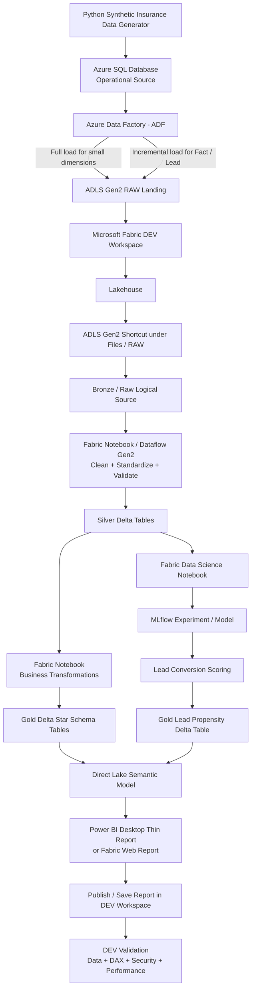
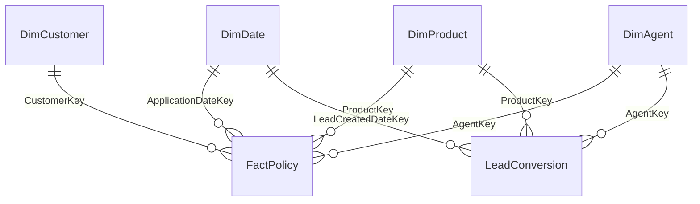
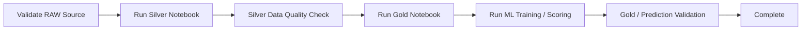
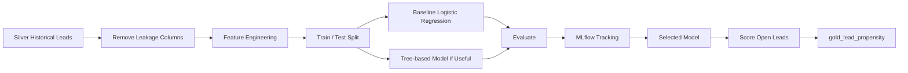

# Daiichi Life Interview Demo – Corrected Azure → Microsoft Fabric → Power BI End-to-End Flow

> **Purpose**  
> This document captures the corrected end-to-end demo architecture and the actual sequence to follow from Azure source data through Microsoft Fabric, Power BI development, validation, and Dev → Test → Prod deployment.  
> The data is fully synthetic and does not represent Daiichi Life customer or production data.

---

## 1. Correct End-to-End Architecture

The solution has **two different flows** and they should not be mixed:

1. **Runtime / data flow** – how data moves and becomes a Power BI report.
2. **Release / deployment flow** – how the completed DEV solution is promoted to TEST and PROD.

### 1.1 Runtime / Data Flow



### 1.2 Release / Deployment Flow

```mermaid
flowchart LR
    A[DEV Solution Validated] --> B[Deployment Pipeline]
    B --> C[Deploy Definitions to TEST]
    C --> D[Apply TEST-specific Connections / Rules]
    D --> E[Run TEST Data Pipelines / Notebooks]
    E --> F[Validate TEST]
    F --> G[Deploy Definitions to PROD]
    G --> H[Apply PROD-specific Connections / Rules]
    H --> I[Run PROD Data Pipelines / Notebooks]
    I --> J[Production Validation]
    J --> K[Monitoring / Operations]
```



> **Important correction:** The deployment pipeline is not part of the raw-data transformation path. It is an ALM/release mechanism used after the solution is built and validated in DEV.

---

## 2. Architecture Summary

### Runtime flow

**Synthetic Source → Azure SQL → ADF → ADLS RAW → Fabric Shortcut → Silver Delta → Gold Delta → ML Scoring → Direct Lake Semantic Model → Power BI Report → DEV Validation**

### Release flow

**DEV Validation → Deployment Pipeline → TEST → TEST Validation → PROD → Production Validation → Monitoring**

### Responsibility split

- **Azure** = operational source simulation, ingestion, and raw landing.
- **Microsoft Fabric** = lakehouse, transformation, data science, semantic model, and orchestration.
- **Power BI** = governed analytics and reporting experience.
- **Deployment Pipeline** = lifecycle promotion across DEV, TEST, and PROD.

---

## 3. Dataset Design

The demo should use realistic synthetic life-insurance data rather than unrelated random values.

| Table | Purpose |
|---|---|
| `DimDate` | Time intelligence and trend analysis |
| `DimCustomer` | Customer segment and geography |
| `DimProduct` | Insurance product hierarchy and attributes |
| `DimAgent` | Distribution channel, branch, and agent performance |
| `FactPolicy` | Policy, premium, renewal, lapse, claims, underwriting metrics |
| `LeadConversion` | Lead pipeline and ML training/scoring source |

### Core relationship model



### Key validation rules

- No duplicate primary keys.
- No orphan foreign keys.
- `IssueDate >= ApplicationDate`.
- Premium and sum-assured values must be positive and logically related.
- Product entry-age rules must be respected.
- Renewal, lapse, and claim dates must be logically valid.
- Singapore geography should be aggregated at planning-area level, not exact customer address level.
- No real PII.
- ML target leakage must be prevented.

---

## 4. Azure Layer

### Step 1 – Resource Group

Create:

`rg-insurance-fabric-demo`

**Why:** Grouping, cost visibility, controlled cleanup, and a clean enterprise-style structure.

### Step 2 – Azure SQL Database

Load the synthetic operational tables:

```text
dbo.DimDate
dbo.DimCustomer
dbo.DimProduct
dbo.DimAgent
dbo.FactPolicy
dbo.LeadConversion
```

Add `LastModifiedDateTime` to changing transactional tables.

**Why:** It provides a realistic operational source and enables incremental ingestion.

### Step 3 – ADLS Gen2

Enable Hierarchical Namespace and create:

```text
raw/
archive/
control/
```

Use Parquet for the raw landing where practical.

**Why:** ADLS becomes the durable landing layer between the operational source and Fabric.

### Step 4 – Azure Data Factory

Pipeline:

`PL_AzureSQL_To_ADLS_Raw`

Use:

- Full load for small dimensions.
- Incremental load for `FactPolicy` and `LeadConversion`.

Example watermark filter:

```sql
WHERE LastModifiedDateTime > @PreviousWatermark
  AND LastModifiedDateTime <= @CurrentWatermark
```

### Important production note

A simple watermark is suitable for the interview demo, but production design must also consider **updates, late-arriving records, and deletes**. Depending on the source, CDC/change tracking or another change-capture strategy may be more appropriate.

### Step 5 – Control / Audit

Track:

```text
TableName
LastSuccessfulWatermark
PipelineRunId
RowsRead
RowsWritten
StartTime
EndTime
Status
```

---

## 5. ADLS → Fabric Integration

### Preferred demo approach – ADLS Gen2 Shortcut

Create the external ADLS Gen2 shortcut **inside the Fabric Lakehouse**, under the `Files` area.

The shortcut acts as a pointer to the ADLS RAW files. It does **not automatically turn ordinary Parquet files into Lakehouse Delta tables**.

Therefore the correct sequence is:

```text
ADLS RAW Parquet
    ↓
Lakehouse Shortcut under Files
    ↓
Notebook / Dataflow reads RAW files
    ↓
Silver Delta Tables written under Lakehouse Tables
```

### Why use a shortcut?

- Avoid unnecessary physical duplication.
- Demonstrate OneLake federation.
- Keep ADLS as the source-of-record landing layer.
- Allow Fabric to process external data without first copying everything.

### When should we physically copy data instead?

Use Fabric Copy/Data Factory when data must be materialized inside Fabric because of performance, retention, isolation, governance, or source-availability requirements.

---

## 6. Fabric DEV Workspace

Create:

```text
Insurance_Fabric_Demo_DEV
```

For full lifecycle design, also have:

```text
Insurance_Fabric_Demo_TEST
Insurance_Fabric_Demo_PROD
```

The deployment pipeline can be configured early, but **promotion happens only after DEV content is ready and validated**.

---

## 7. Fabric Lakehouse and Medallion Layers

Lakehouse:

`lh_insurance_demo`

### Bronze / Raw

Bronze is a **logical raw layer** represented by the ADLS shortcut. If the source files are only Parquet/CSV, keep them under Files and treat them as raw input.

### Silver

Notebook:

`NB_Transform_Insurance_Silver`

Tasks:

1. Read RAW shortcut files.
2. Standardize names and data types.
3. Trim and cleanse values.
4. Handle nulls.
5. Deduplicate.
6. Validate keys and dates.
7. Add data-quality checks.
8. Write trusted Delta tables.

Outputs:

```text
silver_dim_date
silver_dim_customer
silver_dim_product
silver_dim_agent
silver_fact_policy
silver_lead_conversion
```

### Gold

Notebook:

`NB_Build_Insurance_Gold`

Outputs:

```text
gold_dim_date
gold_dim_customer
gold_dim_product
gold_dim_agent
gold_fact_policy
gold_lead_conversion
```

Gold should contain the report-ready star schema and reusable business logic.

---

## 8. Fabric Data Factory Orchestration

Pipeline:

`PL_Insurance_EndToEnd`



**Why:** Production-style orchestration requires dependency management, monitoring, retry handling, and scheduled execution rather than manual notebook execution.

---

## 9. Data Science – Lead Conversion Prediction

Notebook:

`NB_Lead_Conversion_Model`

### Business objective

Predict the probability that an open lead will convert, then surface the result in Power BI as a prioritized sales queue.

### Flow



Track metrics such as ROC-AUC, precision, recall, F1, and confusion matrix.

### Governance note

Demographic or protected/sensitive features should not be used casually for lead conversion. Their use must follow the client's legal, fairness, and governance requirements.

---

## 10. Direct Lake Semantic Model

Create a new Power BI semantic model over the **Gold Delta tables** in the Fabric Lakehouse.

Preferred mode: **Direct Lake**.

### Why Direct Lake?

- Reads Delta data from OneLake without a full Import copy.
- Uses the VertiPaq engine for interactive analytics.
- Fits a Fabric lake-centric architecture.
- Works well for a Gold analytics layer.

### Important correction about refresh

Direct Lake does not behave like a normal Import refresh. It uses **framing/metadata updates** to recognize new Delta-table versions. Automatic updates can be enabled, or framing can be controlled depending on the production consistency requirement.

### Model relationships

```text
DimDate      1-* FactPolicy
DimCustomer  1-* FactPolicy
DimProduct   1-* FactPolicy
DimAgent     1-* FactPolicy

DimDate      1-* LeadConversion / LeadPropensity
DimProduct   1-* LeadConversion / LeadPropensity
DimAgent     1-* LeadConversion / LeadPropensity
```

### Semantic model items

Create:

- Relationships.
- DAX measures.
- Formatting.
- RLS if needed.
- Calculation Groups.

---

## 11. Power BI Development – Correct Sequence

For the **final target architecture**, Power BI Desktop should ideally be a **thin report connected live to the Fabric Direct Lake semantic model**.

Correct sequence:

```text
Gold Delta Tables
    ↓
Direct Lake Semantic Model in Fabric
    ↓
Power BI Desktop connects to Semantic Model
    ↓
Build / Finalize Report Pages
    ↓
Publish Report to DEV Workspace
```

### If the report was already built locally first

If a local PBIX was built using CSV/local/import data, treat it as the **UI prototype**. Before the final interview demo, align/rebuild the report so the visuals use the Fabric semantic model; otherwise the architecture diagram and the actual report implementation would not match.

---

## 12. Power BI Report Pages

Keep five visible pages:

1. **Executive Overview** – active policies, premium, renewal, conversion, lapse, trends.
2. **Policy & Product Performance** – product mix, premium, sum assured, claims, renewal.
3. **Customer & Geography** – segment and Singapore planning-area analysis.
4. **Distribution / Agent Performance** – channels, agents, target attainment, funnel.
5. **AI Lead Conversion** – propensity bands, top leads, expected conversion, potential premium.

### Time Intelligence Calculation Group

```text
Current
MTD
QTD
YTD
Previous Month
Previous Year
YoY %
```

---

## 13. DEV Validation Before Deployment

Before promotion, verify in DEV:

- Row counts and business totals.
- Relationships.
- DAX results.
- Filters and drill behavior.
- Direct Lake connectivity.
- ML output visibility.
- RLS/security behavior where configured.
- Report performance.
- Data lineage.
- Pipeline success history.

Only after this point should the solution be promoted.

---

## 14. Deployment Pipeline – Correct Lifecycle

### Stage structure

```text
DEV → TEST → PROD
```

The pipeline can be created before development, but the actual deployment starts **after DEV validation**.

### Items that can be promoted

Fabric deployment pipelines can promote supported item definitions such as Lakehouse metadata, notebooks, Fabric pipelines, reports, semantic models, and other supported Fabric items.

### Critical correction – Lakehouse data is NOT deployed

Deployment of a Lakehouse does **not copy the actual Delta table data or Files content** to TEST/PROD. The target Lakehouse metadata is deployed, but the target environment must be populated by running its own ingestion/transformation process.

Correct TEST sequence:

```text
Deploy Fabric item definitions to TEST
    ↓
Configure TEST-specific references
    ↓
Run TEST ingestion / Silver / Gold pipelines
    ↓
Create or populate TEST data
    ↓
Validate semantic model + Power BI report
```

The same pattern applies to PROD.

---

## 15. Deployment Binding Issues to Handle

### 15.1 ADLS Shortcut target

External shortcut definitions can retain the same external target across stages. If DEV, TEST, and PROD use different ADLS accounts/containers, configure stage-specific values using an appropriate parameter/variable strategy or update the shortcut definition per environment.

Do not accidentally deploy a PROD workspace that still points to DEV storage.

### 15.2 Direct Lake Semantic Model binding

A Direct Lake semantic model does **not necessarily rebind automatically** to the Lakehouse in the target deployment stage. Use deployment data-source rules / the supported binding approach so the TEST semantic model points to TEST data and PROD points to PROD data.

This is an important production deployment check.

### 15.3 Notebook default Lakehouse

Ensure notebooks in TEST and PROD use the correct target-stage Lakehouse. Use deployment/default-Lakehouse rules or explicit configuration where appropriate.

---

## 16. TEST Stage

After deployment to TEST:

1. Confirm workspace references and permissions.
2. Confirm shortcut/source points to TEST data.
3. Run ingestion and transformation pipelines.
4. Validate Silver and Gold tables.
5. Validate ML output.
6. Validate Direct Lake semantic model binding.
7. Test DAX, RLS, report navigation, and performance.
8. Obtain approval before PROD.

---

## 17. PROD Stage

After approval:

1. Deploy supported item definitions from TEST/DEV to PROD according to the release process.
2. Apply PROD connections/rules.
3. Run PROD ingestion and transformation pipelines.
4. Validate Gold tables and semantic model.
5. Validate Power BI report.
6. Configure production scheduling and monitoring.
7. Grant production consumer access / publish through the agreed Power BI distribution method.

---

## 18. Security and Governance

Be prepared to discuss:

- Microsoft Entra ID.
- Managed Identity / Workspace Identity.
- Azure Key Vault.
- ADLS RBAC and ACLs.
- Workspace roles.
- RLS / OLS.
- Sensitivity labels.
- Purview / lineage.
- Private networking / trusted access where required.
- Least privilege.
- Audit and monitoring.

### Important shortcut-security note

An ADLS Gen2 shortcut requires the Fabric workspace to have a valid connection/identity with permission to the ADLS target. Production security design should not rely on personal credentials.

---

## 19. Main Corrections Made to the Earlier Design

| Earlier issue | Corrected approach |
|---|---|
| Deployment Pipeline shown as a parallel branch directly from the DEV workspace | Deployment is now a separate release flow after DEV solution validation |
| Shortcut visually treated as if it automatically created Bronze Delta tables | Shortcut is treated as RAW data under Files; Silver notebooks materialize trusted Delta tables |
| No explicit Power BI Desktop → DEV publish step | Added semantic model → Desktop thin report → DEV publish → validation |
| Local PBIX could appear to be the final architecture even when using local/import data | Local report is treated as a prototype unless it is connected to the Fabric semantic model |
| Lakehouse deployment implied data moves to TEST/PROD | Corrected: deployment moves definitions/metadata; TEST/PROD data must be populated separately |
| No warning about environment-specific ADLS Shortcut targets | Added stage-specific shortcut/reference configuration requirement |
| No warning about Direct Lake target-stage binding | Added semantic-model data-source rebinding requirement |
| Direct Lake described too much like Import refresh | Corrected to framing / automatic metadata update behavior |
| Watermark incremental load treated as universal production solution | Added CDC/change-handling caveat for updates/deletes/late-arriving data |

---

## 20. Final Correct Architecture

```text
SYNTHETIC SOURCE
      ↓
Azure SQL
      ↓
Azure Data Factory
      ↓
ADLS Gen2 RAW
      ↓
ADLS Shortcut in Fabric Lakehouse / Files
      ↓
Bronze / Raw Logical Layer
      ↓
Fabric Notebook / Dataflow Gen2
      ↓
Silver Delta Tables
      ↓
Gold Delta Star Schema
      ├──────────────→ Fabric ML Notebook / MLflow
      │                       ↓
      │               Gold Lead Propensity
      │                       ↓
      └───────────────────────┘
                  ↓
        Direct Lake Semantic Model
                  ↓
        Power BI Desktop Thin Report
                  ↓
        Publish to DEV Workspace
                  ↓
             DEV Validation
                  ↓
          Deployment Pipeline
                  ↓
               TEST
                  ↓
   Configure TEST + Run TEST Pipelines
                  ↓
          TEST Validation / Approval
                  ↓
               PROD
                  ↓
   Configure PROD + Run PROD Pipelines
                  ↓
       Production Validation
                  ↓
         Scheduling + Monitoring
```

---

## 21. Interview Explanation

> **“I separate the runtime data architecture from the release lifecycle. Azure SQL represents the operational source, ADF lands controlled full and incremental data into ADLS, and Fabric accesses the raw landing through an ADLS shortcut. Fabric notebooks create trusted Silver and Gold Delta tables, and the Data Science notebook adds lead-conversion propensity scores. A Direct Lake semantic model serves the Power BI report. After the complete solution is validated in DEV, I use a deployment pipeline to promote supported definitions to TEST and PROD, then run the environment-specific data pipelines and validate the data and bindings in each stage.”**

---

## 22. Official Microsoft Documentation Used to Verify the Corrected Flow

- Fabric Direct Lake overview: https://learn.microsoft.com/en-us/fabric/fundamentals/direct-lake-overview
- Create ADLS Gen2 shortcut: https://learn.microsoft.com/en-us/fabric/onelake/create-adls-shortcut
- Fabric deployment pipelines overview: https://learn.microsoft.com/en-us/power-bi/create-reports/deployment-pipelines-overview
- Deployment pipeline process / Direct Lake binding behavior: https://learn.microsoft.com/en-us/power-bi/create-reports/deployment-pipelines-process
- Lakehouse Git and deployment-pipeline behavior: https://learn.microsoft.com/en-us/fabric/data-engineering/lakehouse-git-deployment-pipelines
- Fabric Data Factory activity overview: https://learn.microsoft.com/en-us/fabric/data-factory/activity-overview
- Create a Fabric semantic model / Direct Lake report: https://learn.microsoft.com/en-us/fabric/data-warehouse/create-semantic-model

---

## Final Note

This is the **interview-demo reference architecture**, not a claim that Daiichi Life Singapore uses this exact implementation. In a production engagement, first confirm the client's current source systems, Azure services, Fabric capacity, security, networking, data volume, environment strategy, and existing semantic models before finalizing the design.
