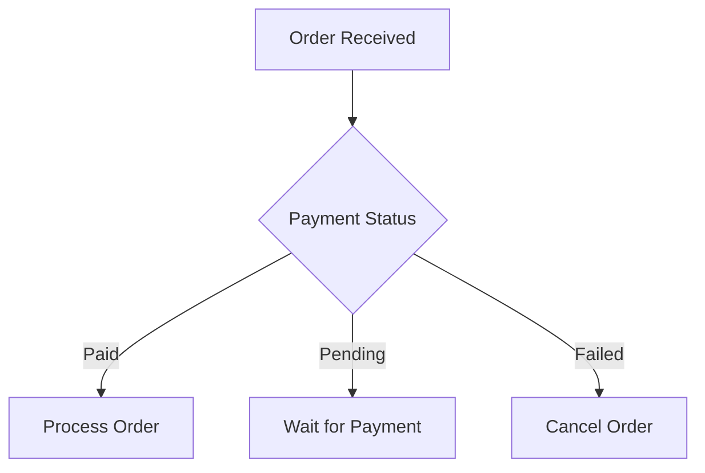
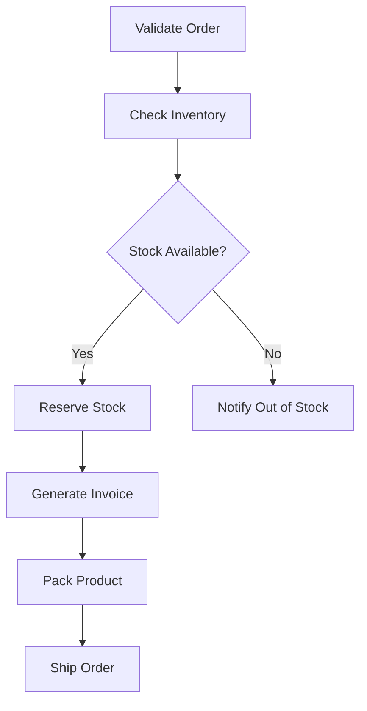
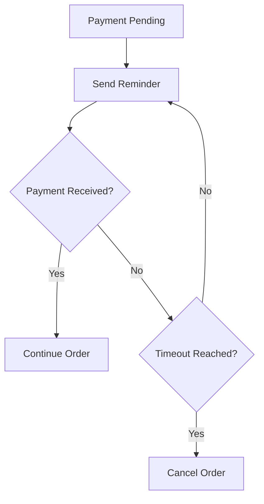
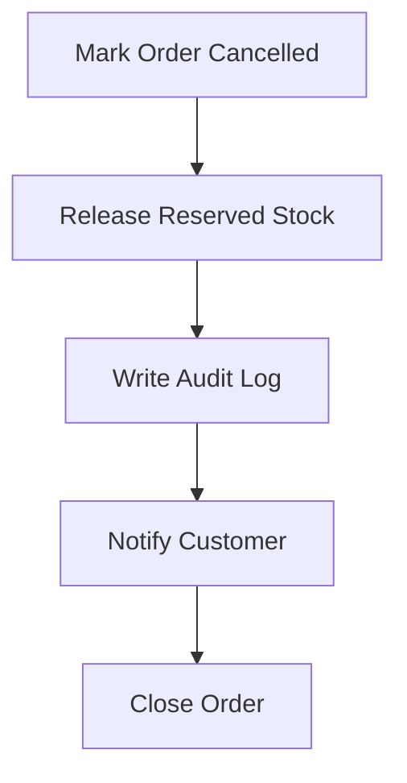
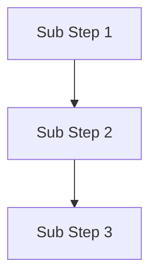
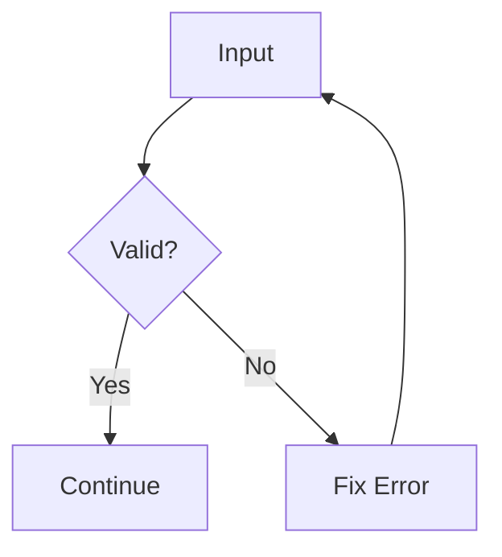
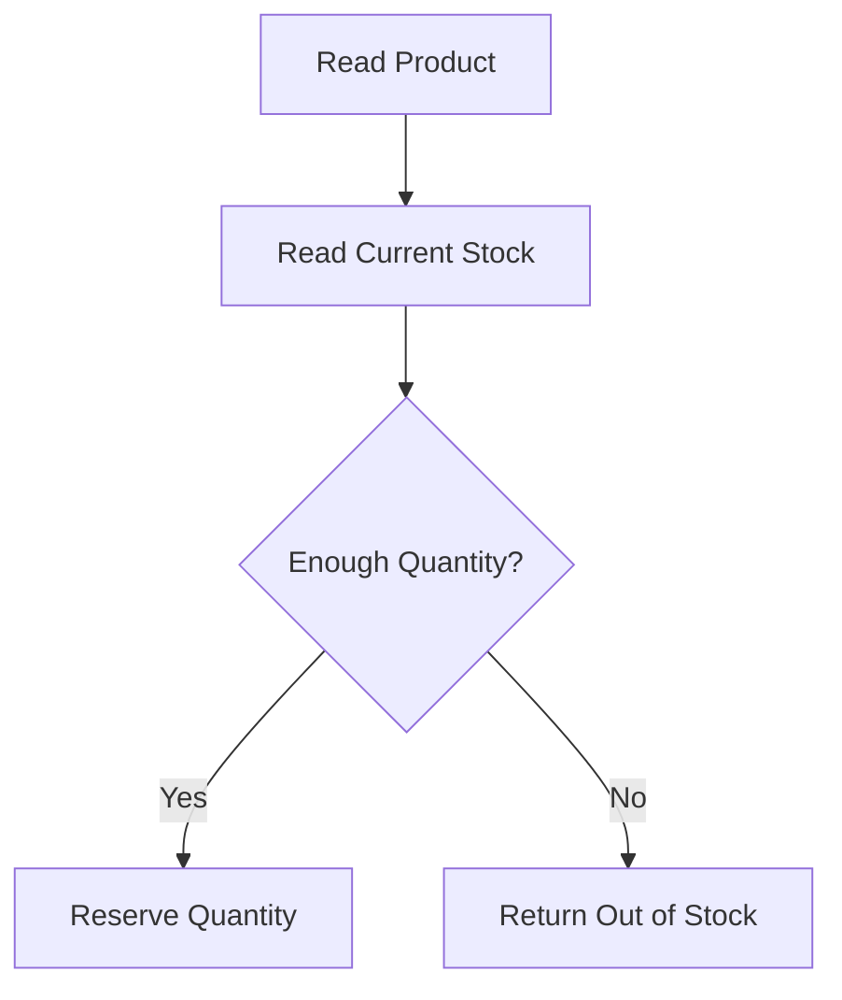
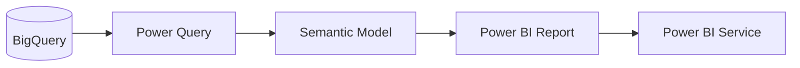
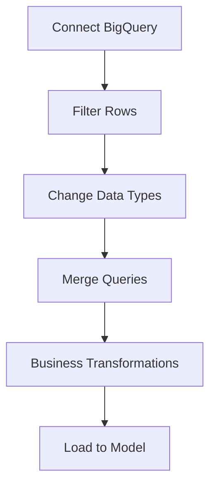
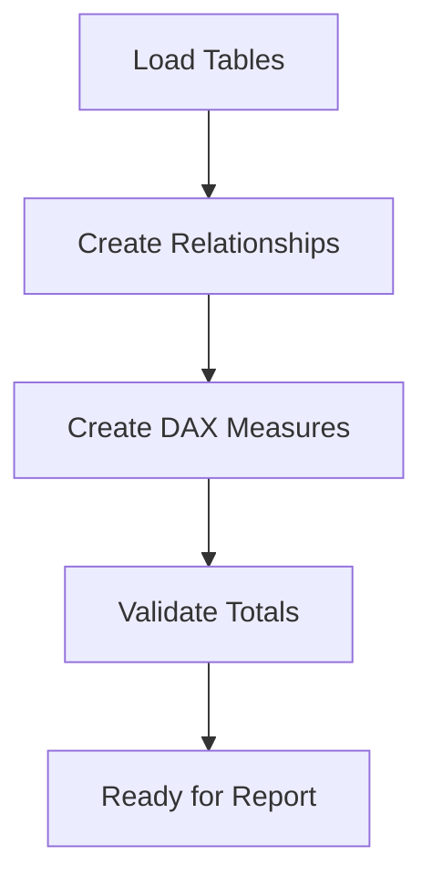

# Mermaid Flowchart — Working Drill-down / Expand Guide

> இந்த file GitHub `.md`-ல் **உண்மையாக click செய்து expand/collapse test செய்ய** rewrite செய்யப்பட்டுள்ளது.

## முதலில் தெரிந்துகொள்ள வேண்டியது

Pure GitHub Markdown + Mermaid-ல் ஒரு Mermaid node-ஐ click செய்தவுடன் **அதே diagram-க்குள் child nodes dynamically expand ஆகும் native feature இல்லை**.

GitHub `.md`-க்கு practical working pattern:

1. மேலே high-level Mermaid flow.
2. கீழே ஒவ்வொரு major step-க்கும் `<details>` section.
3. `<summary>`-ஐ click செய்தால் detailed Mermaid flow expand/collapse ஆகும்.

---

# 1. Live Demo — இதை இங்கேயே click செய்து test செய்யலாம்



<details>
<summary><b>▶ Process Order — Click to expand</b></summary>



</details>

<details>
<summary><b>▶ Wait for Payment — Click to expand</b></summary>



</details>

<details>
<summary><b>▶ Cancel Order — Click to expand</b></summary>



</details>

---

# 2. இது எப்படி வேலை செய்கிறது?

Mermaid diagram:


அதற்கு கீழே native HTML `<details>` / `<summary>`:

```html
<details>
<summary><b>▶ View detailed flow</b></summary>

<!-- detailed content here -->

</details>
```

`<summary>` line-ஐ GitHub-ல் click செய்தால் content open/close ஆகும்.

---

# 3. Reusable Pattern

கீழே உள்ள pattern-ஐ copy செய்து உங்கள் documentation-ல் பயன்படுத்தலாம்.

```markdown
## Main Flow


<details>
<summary><b>▶ Main Step 1 — Details</b></summary>



</details>

<details>
<summary><b>▶ Main Step 2 — Details</b></summary>



</details>
```

> மேலே code sample மட்டும். இந்த file-ன் Section 1-ல் actual live expandable version உள்ளது.

---

# 4. Nested Drill-down

ஒரு detail section-க்குள் இன்னொரு detail section-ஐ nested-ஆ வைக்கலாம்.

<details>
<summary><b>▶ Order Processing</b></summary>


<details>
<summary><b>▶ Inventory — Technical Detail</b></summary>



</details>

</details>

---

# 5. Power BI Example



<details>
<summary><b>▶ Power Query Transformation — Click to expand</b></summary>



</details>

<details>
<summary><b>▶ Semantic Model — Click to expand</b></summary>



</details>

---

# 6. Node-ஐயே click செய்தால் same graph expand ஆகுமா?

இல்லை — GitHub Markdown-ல் native Mermaid flowchart பயன்படுத்தும்போது:

- `Process Order` box click → அதே graph-க்குள் child nodes dynamically appear ஆகாது.
- Mermaid graph runtime-ல் topology change செய்து auto-layout செய்ய GitHub Markdown custom JavaScript allow செய்யாது.
- `click` directive சில Mermaid environments-ல் URL/callback navigation-க்கு பயன்படும்; ஆனால் அது GitHub `.md`-ல் true inline expand/collapse ஆகாது.

அதனால் `.md` மட்டும் பயன்படுத்த வேண்டுமெனில் `<details>` pattern தான் reliable solution.

---

# 7. Exact UI Difference

நீங்கள் originally நினைத்தது:

```text
[Process Order]   <-- click
      ↓
[Validate]
      ↓
[Inventory]
      ↓
[Invoice]
```

இந்த exact behavior-க்கு custom HTML + JavaScript / custom Mermaid viewer தேவை.

GitHub `.md`-ல் கிடைக்கக்கூடிய behavior:

```text
Main Mermaid Flow

▶ Process Order — Click to expand
    └── Detailed Mermaid Flow
```

---

# 8. Recommended Project Documentation Pattern

```text
High-Level Architecture
        ↓
Main Mermaid Diagram
        ↓
Expandable Business Flows
        ↓
Expandable Technical Flows
        ↓
Nested Detailed Flows
```

இந்த structure பெரிய project documentation-க்கும் clean-ஆ maintain செய்யலாம்.

---

# 9. Final Rule

**GitHub `.md` + Mermaid:**

- Diagram = Mermaid
- Expand / Collapse = `<details>`
- Clickable heading = `<summary>`
- Nested drill-down = nested `<details>`
- True node-click inline expansion = custom web UI தேவை

இந்த file-ன் Section 1 மற்றும் Section 4-ல் இருக்கும் arrows (`▶`) click செய்து actual expand/collapse behavior-ஐ test செய்யலாம்.