# Mermaid Flowchart — Same-File Click Drill-down Guide

> Goal: **Mermaid flowchart node-ஐ click செய்தால், இதே Markdown file-ல் இருக்கும் detailed flow section-க்கு route ஆக வேண்டும்.**

இந்த version-ல் `<details>` expand/collapse-ஐ main approach ஆக பயன்படுத்தவில்லை. அதற்கு பதிலாக Mermaid `click` directive + same-file heading anchors பயன்படுத்தப்படுகிறது.

---

# 1. Main Flow — Nodes are Clickable

கீழே இருக்கும் `Process Order`, `Wait for Payment`, `Cancel Order` nodes-ஐ click செய்தால் இந்த same `.md` file-ல் இருக்கும் respective detailed section-க்கு செல்லும்.

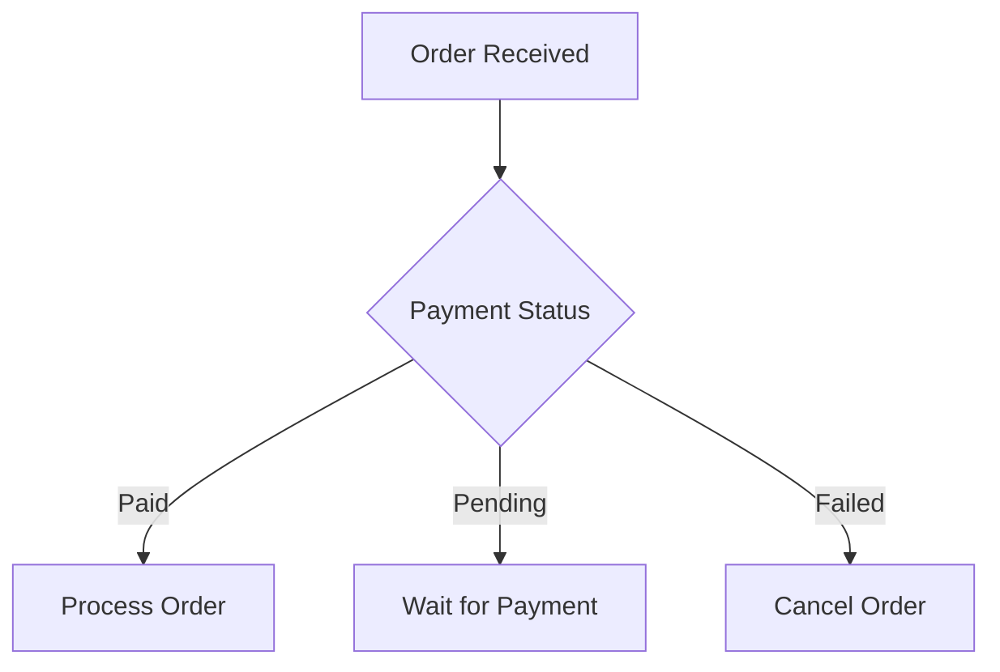

Fallback links:

- [Process Order Details](#process-order-details)
- [Wait for Payment Details](#wait-for-payment-details)
- [Cancel Order Details](#cancel-order-details)

---

# 2. Process Order Details

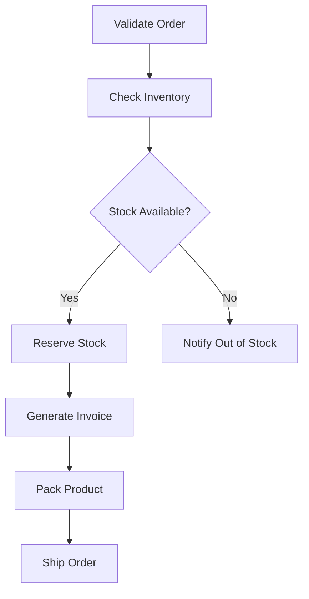

[⬆ Back to Main Flow](#1-main-flow--nodes-are-clickable)

---

# 3. Wait for Payment Details

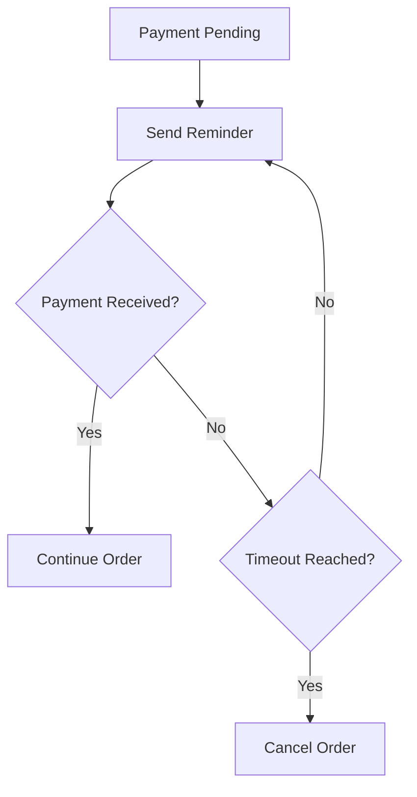

[⬆ Back to Main Flow](#1-main-flow--nodes-are-clickable)

---

# 4. Cancel Order Details

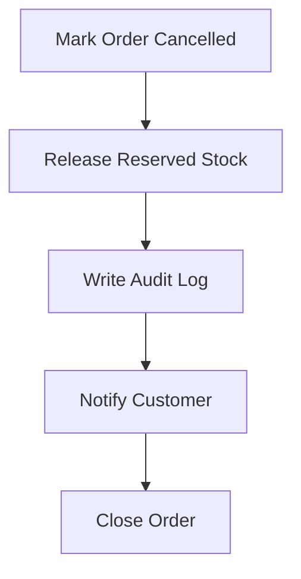

[⬆ Back to Main Flow](#1-main-flow--nodes-are-clickable)

---

# 5. How Same-File Routing Works

Mermaid syntax:


Important parts:

```text
click B "FULL_SAME_FILE_URL#heading-anchor" "Tooltip" _self
```

- `B` = clickable node ID.
- URL = இதே Markdown file URL.
- `#heading-anchor` = கீழே இருக்கும் heading-ன் GitHub anchor.
- `_self` = same browser tab-ல் open செய்ய முயலும்.

GitHub heading:

```markdown
## Detailed Step Example
```

அதன் anchor பொதுவாக:

```text
#detailed-step-example
```

---

# 6. Detailed Step Example

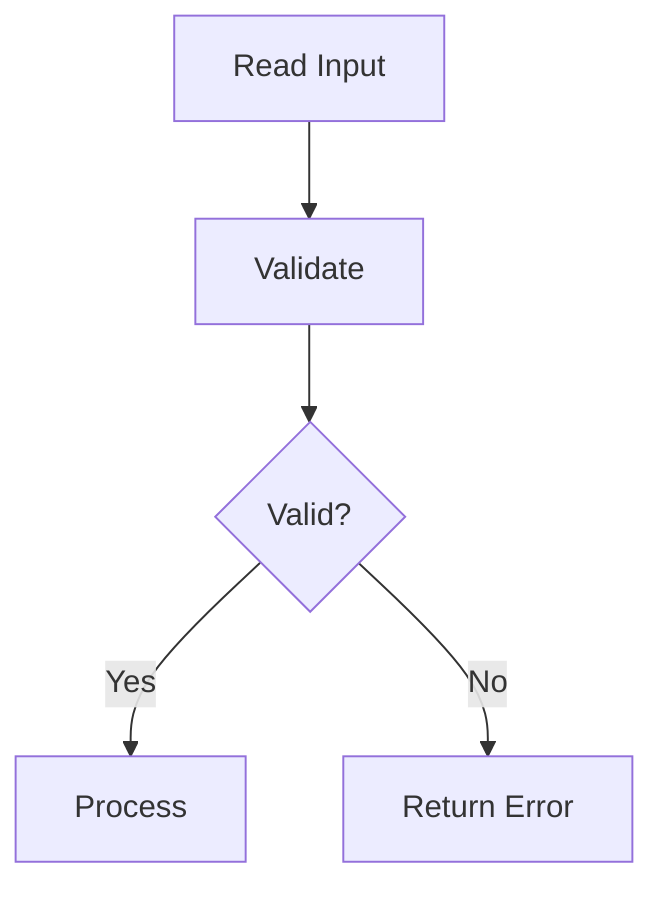

[⬆ Back to Main Flow](#1-main-flow--nodes-are-clickable)

---

# 7. Reusable Template

இந்த pattern-ஐ வேறு project-க்கும் reuse செய்யலாம்.

```markdown
## Main Flow

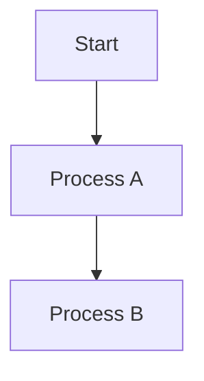

## Process A Details

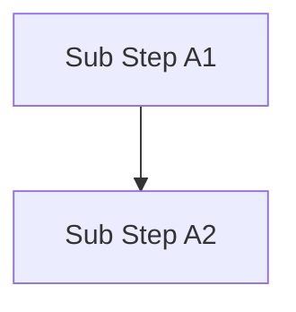

[Back to Main Flow](#main-flow)

## Process B Details

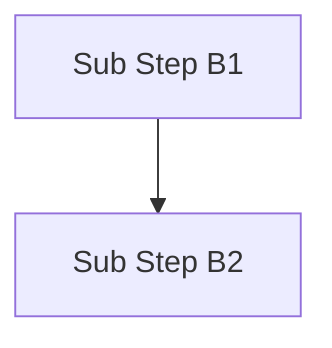
```

---

# 8. Power BI Same-File Drill-down Example

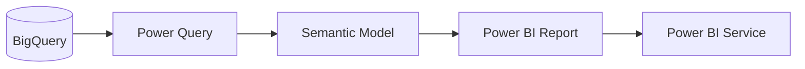

Fallback:

- [Power Query Details](#9-power-query-details)
- [Semantic Model Details](#10-semantic-model-details)

---

# 9. Power Query Details

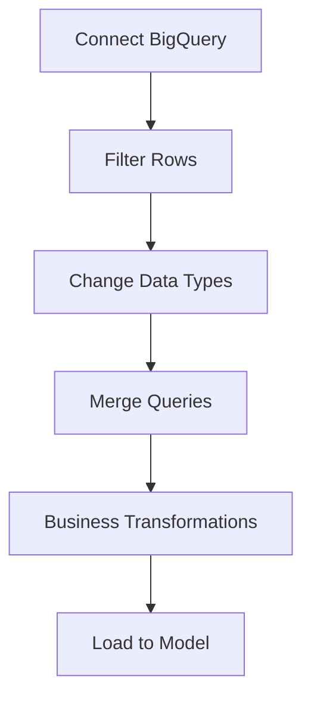

[⬆ Back to Power BI Main Flow](#8-power-bi-same-file-drill-down-example)

---

# 10. Semantic Model Details

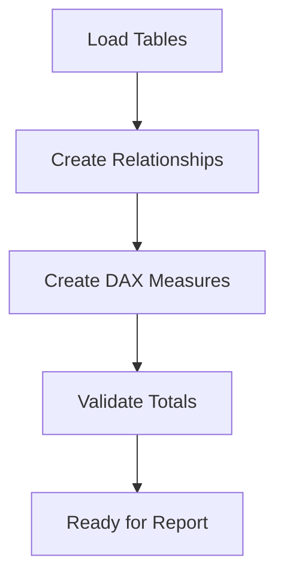

[⬆ Back to Power BI Main Flow](#8-power-bi-same-file-drill-down-example)

---

# 11. Important Limitation

இந்த approach:

```text
Node click
   ↓
Same Markdown file
   ↓
Detailed section
   ↓
Detailed Mermaid flow
```

என்று **navigation-based drill-down** தரும்.

ஆனால்:

```text
Node click
   ↓
Same Mermaid diagram dynamically expands
   ↓
Child nodes appear inside the same graph
```

இந்த true inline expansion GitHub Markdown + native Mermaid மட்டும் வைத்து கிடையாது.

மேலும் Mermaid `click` interaction renderer/security configuration-ஐ பொறுத்து disable ஆகலாம். அதனால்தான் ஒவ்வொரு diagram கீழேயும் normal Markdown fallback links வைத்திருக்கிறோம்.

---

# 12. Correct `click` Syntax

External URL:

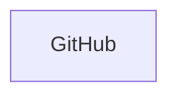

Same file section:

```text
click NODE "https://github.com/OWNER/REPO/blob/main/path/file.md#section-anchor" "View Details" _self
```

Incorrect:

```text
click A "[https://github.com](https://github.com)"
```

Mermaid `click` URL-க்குள் Markdown link syntax போட வேண்டாம்.

---

# 13. Recommended Documentation Pattern

```text
High-Level Mermaid
     │
     ├── click node → Detail Section A
     │                   ↓
     │              Detailed Mermaid
     │                   ↓
     │              Back to Main Flow
     │
     ├── click node → Detail Section B
     │                   ↓
     │              Detailed Mermaid
     │
     └── click node → Detail Section C
```

இந்த approach `.md` documentation-ல் high-level diagram clean-ஆ வைத்துக்கொண்டு, தேவையான detail-க்கு drill-down navigation கொடுக்க useful.