# Mermaid Flowchart — Click, Drill-down & Expand/Collapse Guide

இந்த document-ன் goal:

> Mermaid flowchart-ல் ஒரு box / node click பண்ணும்போது, அந்த node-க்கு related detailed flow எப்படி காட்டலாம்?

முக்கியமாக, native Mermaid என்ன support செய்கிறது, என்ன support செய்யாது, Markdown-ல் practical-ஆ எப்படி செய்யலாம் என்பதைக் காண்போம்.

---

# 1. முக்கியமான உண்மை

Mermaid native flowchart-ல்:

```text
Node click
   ↓
Same diagram-க்குள் அந்த box expand ஆகி
sub-flow open ஆகும்
```

இந்த exact behavior **direct native feature ஆக இல்லை**.

அதாவது:

```text
[Process Order]
```

இந்த box click பண்ணியவுடன்:

```text
[Process Order]
      ↓
[Validate]
      ↓
[Check Stock]
      ↓
[Invoice]
```

என்று same graph-க்குள் dynamically expand/collapse ஆகுவது Mermaid மட்டும் வைத்து straightforward-ஆ செய்ய முடியாது.

---

# 2. Mermaid என்ன support செய்கிறது?

Mermaid flowchart-ல் click interaction மூலம்:

- URL open செய்யலாம்
- Same page anchor-க்கு jump செய்யலாம்
- Another documentation section-க்கு செல்லலாம்
- JavaScript callback use செய்யலாம் (custom HTML environment)
- Separate detailed Mermaid diagram காட்டலாம்

ஆனால்:

- Native node expand/collapse
- Dynamic subtree expand
- Interactive drill-down inside same graph

இவை built-in Mermaid feature இல்லை.

---

# 3. Markdown-க்கு Best Practical Method

Markdown documentation-ல் மிகவும் clean solution:

```text
Main Flowchart
      ↓
Expandable <details> section
      ↓
Detailed Mermaid Flowchart
```

இதனால் user summary title click பண்ணும்போது detailed flow open / close செய்யலாம்.

---

# 4. Basic Expandable Markdown Example

````markdown
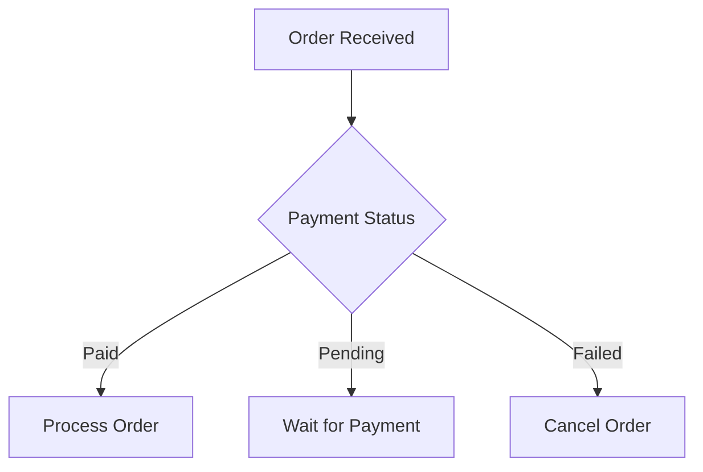

<details>
<summary><b>Process Order - Detailed Flow</b></summary>

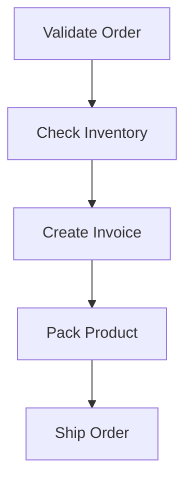

</details>
````

Rendered idea:

```text
Main Diagram

▼ Process Order - Detailed Flow
   [Validate Order]
          ↓
   [Check Inventory]
          ↓
   [Create Invoice]
          ↓
   [Pack Product]
          ↓
   [Ship Order]
```

---

# 5. Multiple Expandable Sections

ஒரே main flowchart-க்கு பல detailed sections வைத்துக்கொள்ளலாம்.

````markdown


<details>
<summary><b>Process Order</b></summary>

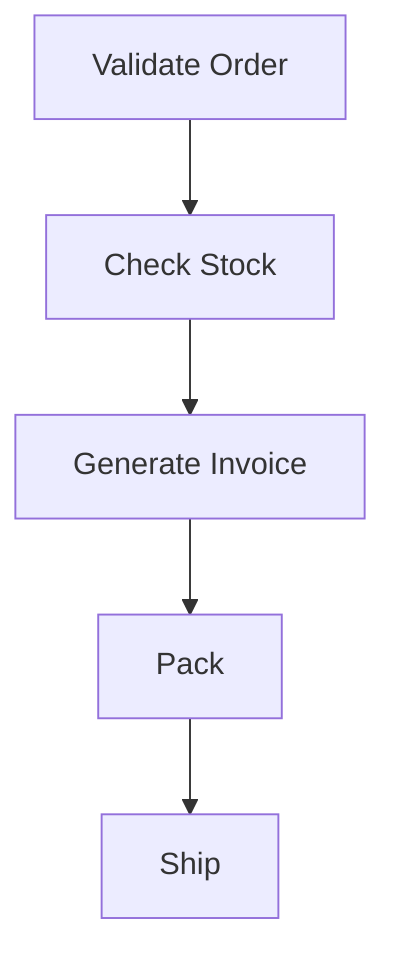

</details>

<details>
<summary><b>Wait for Payment</b></summary>

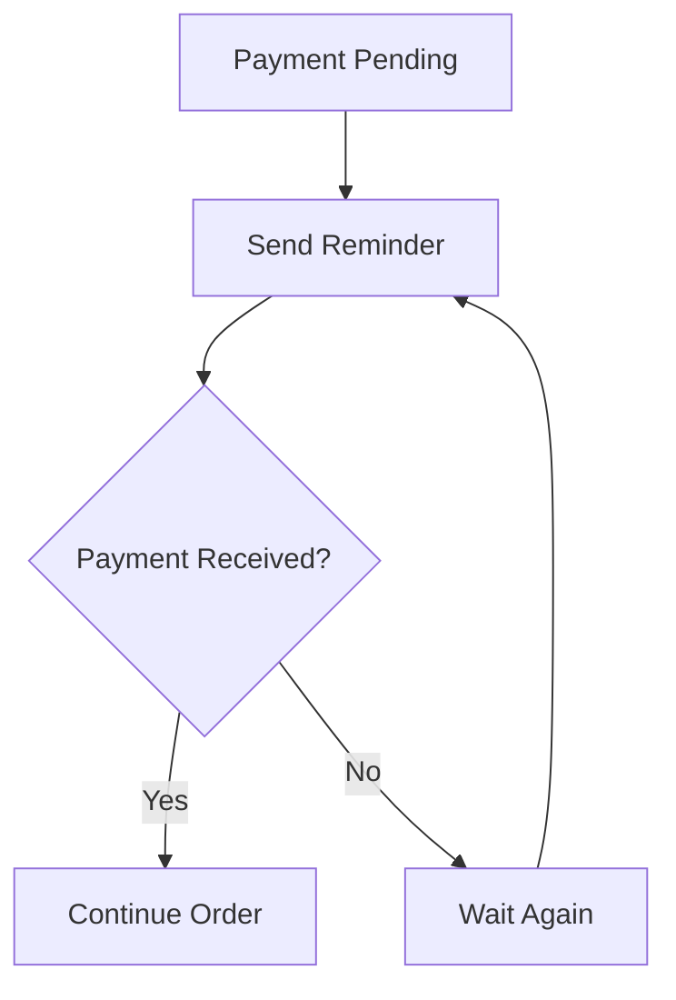

</details>

<details>
<summary><b>Cancel Order</b></summary>

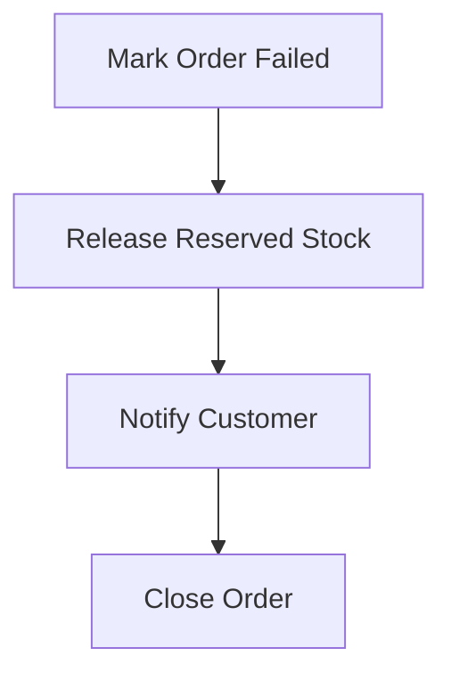

</details>
````

---

# 6. Click Node → Jump to Detailed Section

Mermaid `click` syntax use செய்து ஒரு node click பண்ணும்போது detailed section-க்கு jump செய்யலாம்.

Example:

````markdown


<a id="process-order"></a>

## Process Order


````

இதில்:

```text
click C "#process-order"
```

என்பது:

```text
Process Order node click
          ↓
Process Order section
```

என்று jump செய்ய முயலும்.

> Note: Click behavior Markdown renderer / platform support-ஐ பொறுத்து மாறலாம்.

---

# 7. Click Node + Expandable Section

இரண்டு concepts-ஐ combine செய்யலாம்:

- Main diagram node click
- Related section-க்கு jump
- அந்த section expandable `<details>`

Example:

````markdown


<a id="process-order"></a>

<details>
<summary><b>Process Order - Detailed Flow</b></summary>


</details>
````

இதுதான் Markdown documentation-க்கு practical drill-down style.

---

# 8. Hierarchical Documentation Pattern

Large process இருந்தால்:

```text
Level 1
High-Level Flow

Level 2
Expandable Sub-Flows

Level 3
Detailed Technical Flow
```

Example:

```text
Order Management
│
├── Payment
│   ├── Successful Payment
│   ├── Pending Payment
│   └── Failed Payment
│
├── Processing
│   ├── Inventory
│   ├── Invoice
│   └── Packing
│
└── Delivery
    ├── Courier Assignment
    ├── Dispatch
    └── Delivery
```

---

# 9. Level 1 — Main Flow

````markdown
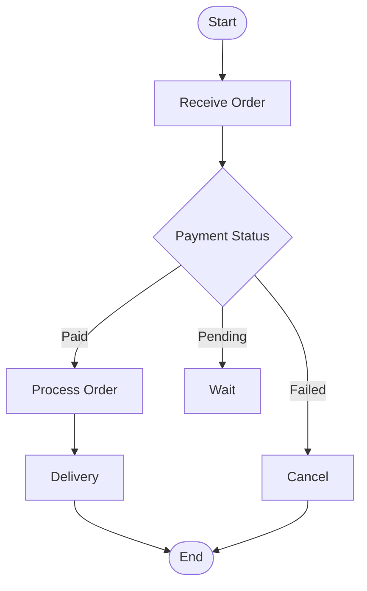
````

---

# 10. Level 2 — Processing Detail

````markdown
<details>
<summary><b>Order Processing Flow</b></summary>

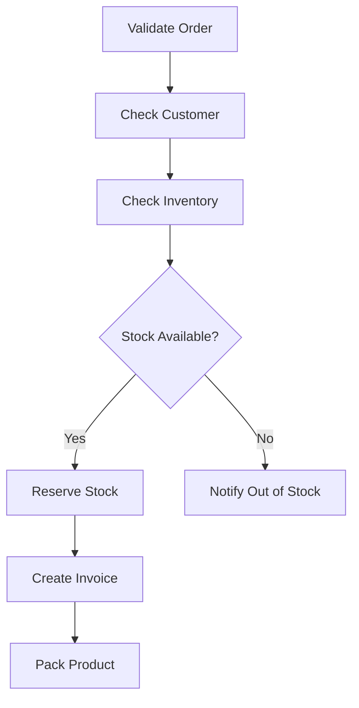

</details>
````

---

# 11. Level 3 — Inventory Detail

````markdown
<details>
<summary><b>Inventory Check - Technical Flow</b></summary>

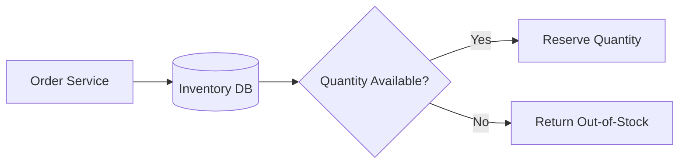

</details>
````

---

# 12. Best Documentation Structure

Recommended structure:

```text
# System Name

## High-Level Flow
Main Mermaid

## Detailed Flows

<details>
Process A
    Detailed Mermaid
</details>

<details>
Process B
    Detailed Mermaid
</details>

<details>
Process C
    Detailed Mermaid
</details>
```

இது GitHub documentation-க்கு clean-ஆவும் scalable-ஆவும் இருக்கும்.

---

# 13. Example — Complete Order Workflow

````markdown
# Order Workflow

## Main Flow

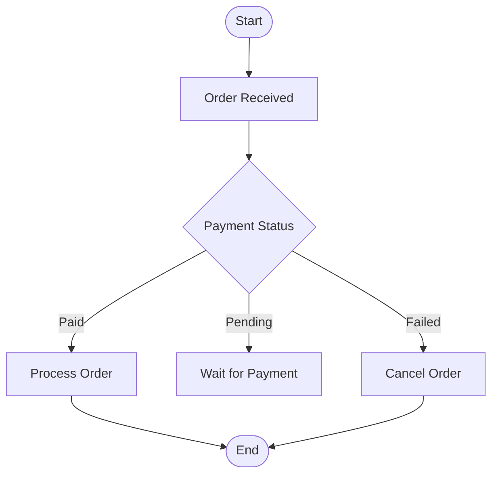

---

<details>
<summary><b>Process Order</b></summary>

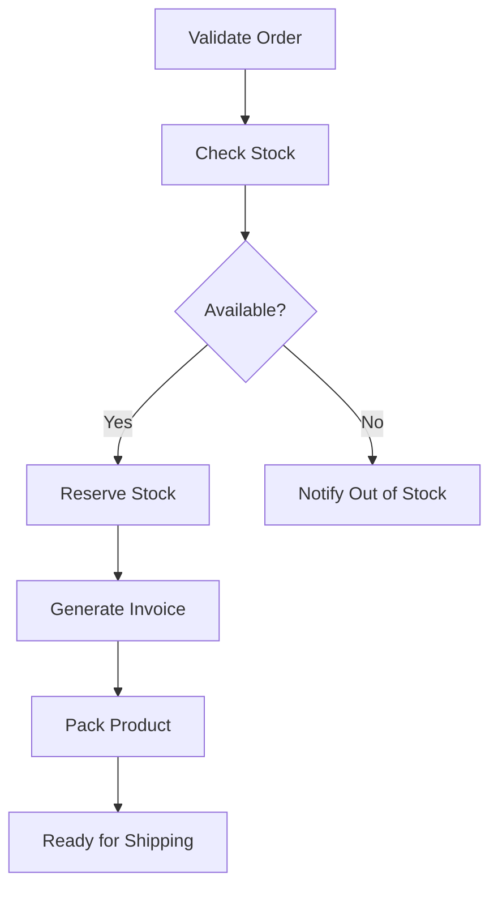

</details>

---

<details>
<summary><b>Wait for Payment</b></summary>

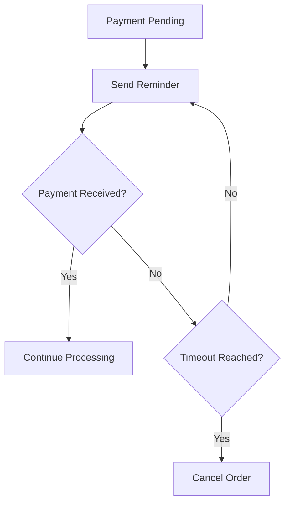

</details>

---

<details>
<summary><b>Cancel Order</b></summary>

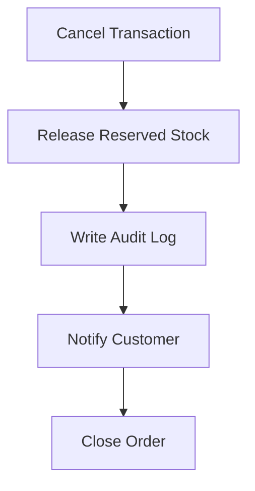

</details>
````

---

# 14. Native Mermaid Expand/Collapse ஏன் இல்லை?

Mermaid primarily:

```text
Text
  ↓
Diagram Definition
  ↓
Static SVG Rendering
```

என்ற model-ல் வேலை செய்கிறது.

அதனால் diagram topology runtime-ல்:

```text
Click
 ↓
Add Nodes
 ↓
Recalculate Layout
 ↓
Expand Branch
```

என்று automatically handle செய்யாது.

அதை செய்ய custom JavaScript application logic தேவைப்படும்.

---

# 15. Custom HTML பயன்படுத்தினால் என்ன செய்யலாம்?

Markdown restriction இல்லாமல் custom website / app use செய்தால்:

```text
Node Click
    ↓
JavaScript Event
    ↓
Show Hidden Container
    ↓
Render Child Mermaid
```

இதனால்:

- modal
- side panel
- popup
- accordion
- expand/collapse
- dynamic child graph

போன்ற UI build செய்யலாம்.

ஆனால் இது pure `.md` solution இல்லை.

---

# 16. Markdown vs HTML Comparison

| Feature | Markdown + Mermaid | Custom HTML + Mermaid |
|---|---|---|
| Basic diagram | Yes | Yes |
| Node click link | Yes / platform dependent | Yes |
| Anchor navigation | Yes | Yes |
| `<details>` expand | Yes | Yes |
| Node click → true inline expansion | No | Yes, custom JS |
| Modal | No | Yes |
| Side panel | No | Yes |
| Dynamic graph update | No | Yes |
| Best for GitHub docs | Yes | Possible |
| Coding required | Low | Medium / High |

---

# 17. Recommended Approach for `.md`

If final output must remain a Markdown file:

## Use this combination

```text
Main Mermaid Flow
        +
<details>
        +
Detailed Mermaid
```

Optional:

```text
click node
    ↓
jump to detailed section
```

இது readability + maintainability இரண்டுக்கும் நல்ல approach.

---

# 18. Reusable Template

இந்த template-ஐ எந்த project-க்கும் reuse செய்யலாம்.

````markdown
# Project Flow

## Main Flow

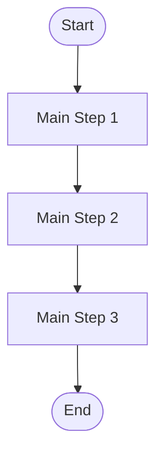

---

<details>
<summary><b>Main Step 1 - Detailed Flow</b></summary>

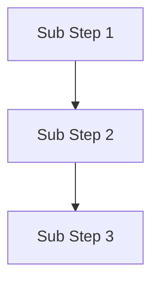

</details>

---

<details>
<summary><b>Main Step 2 - Detailed Flow</b></summary>

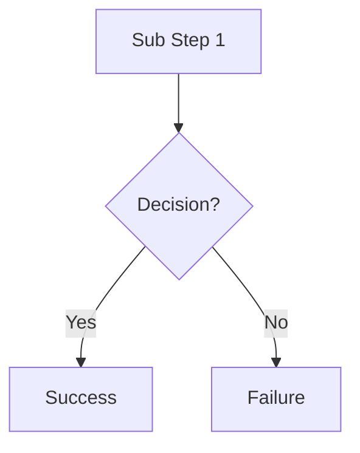

</details>

---

<details>
<summary><b>Main Step 3 - Detailed Flow</b></summary>

```mermaid
flowchart TD
    C1[Input]
    C2[Process]
    C3[Output]

    C1 --> C2 --> C3
```

</details>
````

---

# 19. Nested `<details>` கூட செய்யலாம்

Markdown renderer support இருந்தால்:

````markdown
<details>
<summary><b>Process Order</b></summary>

```mermaid
flowchart TD
    A[Validate]
    B[Inventory]
    C[Invoice]

    A --> B --> C
```

<details>
<summary><b>Inventory Details</b></summary>

```mermaid
flowchart TD
    I1[Read Product]
    I2[Check Quantity]
    I3{Enough Stock?}

    I1 --> I2 --> I3
```

</details>

</details>
````

இதனால்:

```text
Process Order
   └── Inventory Details
```

என்று hierarchical expand/collapse documentation உருவாக்கலாம்.

> Nested `<details>` rendering platform-ஐ பொறுத்து vary ஆகலாம்.

---

# 20. Final Recommendation

உங்கள் requirement:

> Main flowchart simple-ஆ இருக்க வேண்டும்.  
> ஒரு process-க்கு detailed flow தேவையான போது மட்டும் expand செய்து பார்க்க வேண்டும்.

அதற்கு Markdown-ல் best pattern:

```text
High-Level Mermaid
       ↓
Expandable <details>
       ↓
Detailed Mermaid
       ↓
Optional Nested Details
```

### Best use cases

- GitHub README
- Project architecture docs
- Technical design documents
- Workflow documentation
- Power BI process documentation
- ETL documentation
- Software development lifecycle documentation
- SOP documents

---

# Quick Cheat Sheet

### Main flow

````markdown
```mermaid
flowchart TD
    A --> B --> C
```
````

### Expandable detailed flow

````markdown
<details>
<summary><b>View Details</b></summary>

```mermaid
flowchart TD
    A1 --> A2 --> A3
```

</details>
````

### Clickable node

```text
click NODE "#section-id" "View Details"
```

### Anchor

```html
<a id="section-id"></a>
```

---

# Final Concept

```text
Mermaid
   =
Diagram

Markdown <details>
   =
Expand / Collapse

Mermaid click
   =
Navigation

Custom JavaScript
   =
True Interactive Drill-down
```

Pure Markdown documentation-க்கு:

> **Mermaid + `<details>` is the most practical expandable flowchart pattern.**
