# Mermaid Flowchart Tutorial — Basic to Advanced

இந்த tutorial Markdown (`.md`) file-ல் Mermaid பயன்படுத்தி **Flowchart** உருவாக்க கற்றுக்கொள்ள உதவும்.

> முக்கியம்: Mermaid support உள்ள Markdown viewer தேவை.  
> GitHub, GitLab, Obsidian, Typora, VS Code extensions போன்ற பல tools Mermaid-ஐ render செய்யும்.

---

# 1. Mermaid என்றால் என்ன?

Mermaid என்பது text syntax பயன்படுத்தி diagram உருவாக்கும் tool.

Markdown-ல்:

````markdown
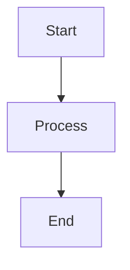
````

இதுபோல் எழுதினால் diagram render ஆகும்.


---

# 2. Flowchart Basic Structure

Mermaid flowchart பொதுவாக இப்படித்தான் ஆரம்பிக்கும்:

```text
flowchart TD
```

இதில்:

| Syntax | Direction |
|---|---|
| `TD` | Top → Down |
| `TB` | Top → Bottom |
| `BT` | Bottom → Top |
| `LR` | Left → Right |
| `RL` | Right → Left |

Example:

```mermaid
flowchart TD
    A[Login] --> B[Dashboard] --> C[Logout]
flowchart TB
    A[Login] --> B[Dashboard] --> C[Logout]
flowchart BT
    A[Login] --> B[Dashboard] --> C[Logout]
flowchart LR
    A[Login] --> B[Dashboard] --> C[Logout]
flowchart RL
    A[Login] --> B[Dashboard] --> C[Logout]
```

---

# 3. Node என்றால் என்ன?

Flowchart-ல் ஒவ்வொரு box / shape-மும் ஒரு **Node**.

Basic syntax:

```text
A[Start]
```

இதில்:

- `A` = Node ID
- `Start` = Screen-ல் தெரியும் text

Example:


Node ID unique ஆக இருக்க வேண்டும்.

---

# 4. Nodes-ஐ Connect செய்வது

Simple arrow:

```text
A --> B
```

Example:

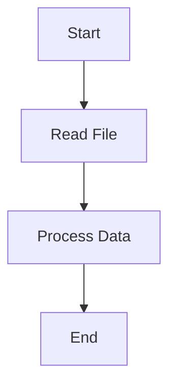

Short form:

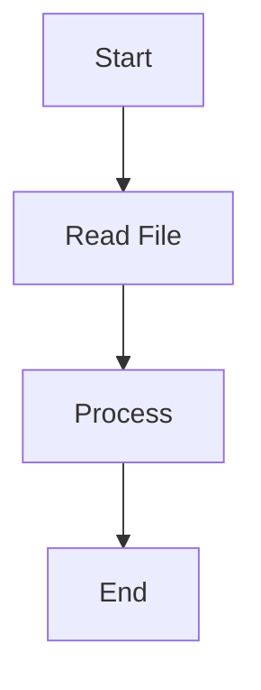

---

# 5. Common Node Shapes

## Rectangle

```text
A[Process]
```

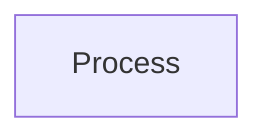

## Rounded Rectangle

```text
A(Rounded)
```

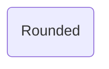

## Stadium / Pill

```text
A([Start])
```

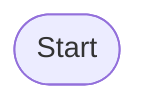

## Circle

```text
A((Connector))
```

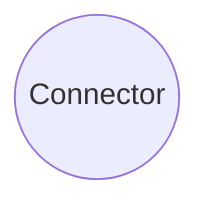

## Decision / Diamond

```text
A{Valid?}
```

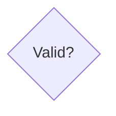

## Hexagon

```text
A{{Preparation}}
```


## Parallelogram

```text
A[/Input/]
```

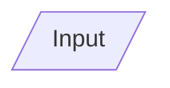

## Reverse Parallelogram

```text
A[\Output\]
```

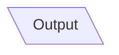

## Trapezoid

```text
A[/Manual Operation\]
```

## Database / Cylinder

```text
A[(Database)]
```

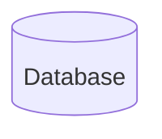

---

# 6. Arrow Types

## Normal Arrow

```text
A --> B
```

## Line without arrow

```text
A --- B
```

## Dotted Arrow

```text
A -.-> B
```

## Thick Arrow

```text
A ==> B
```

## Dotted Line

```text
A -.- B
```

Example:

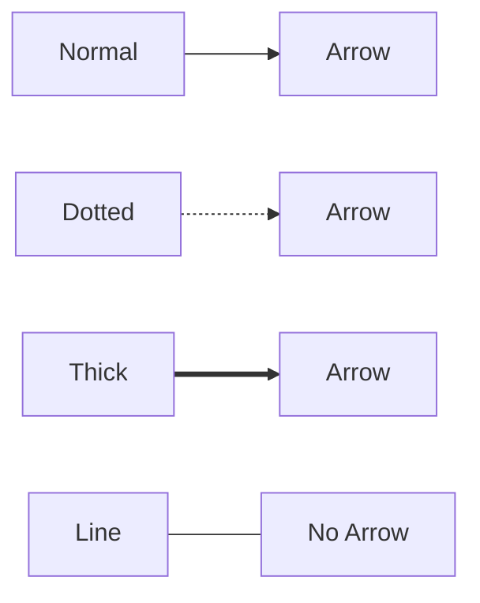

---

# 7. Arrow Label / Connection Text

Arrow மேலே text காட்ட:

```text
A -->|Yes| B
```

Example:

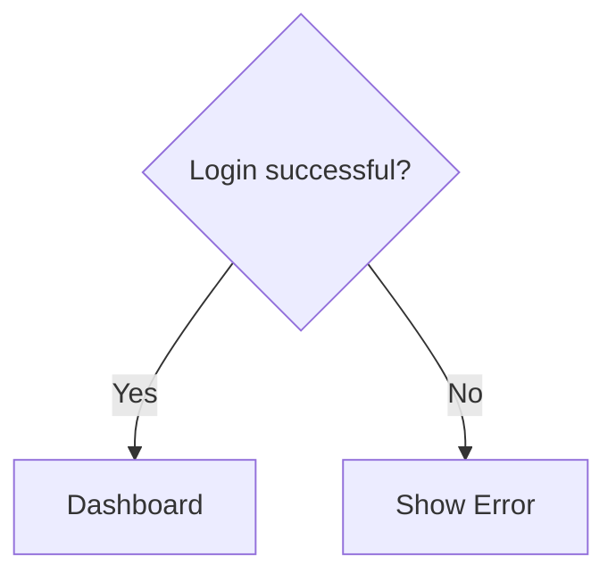

Alternative syntax:

```text
A -- Yes --> B
```

Example:

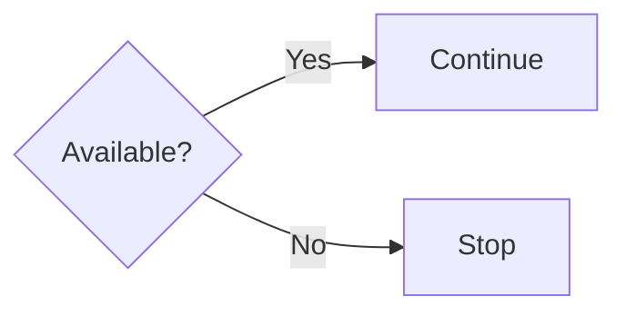

---

# 8. Decision Flow

Real-world flowchart:

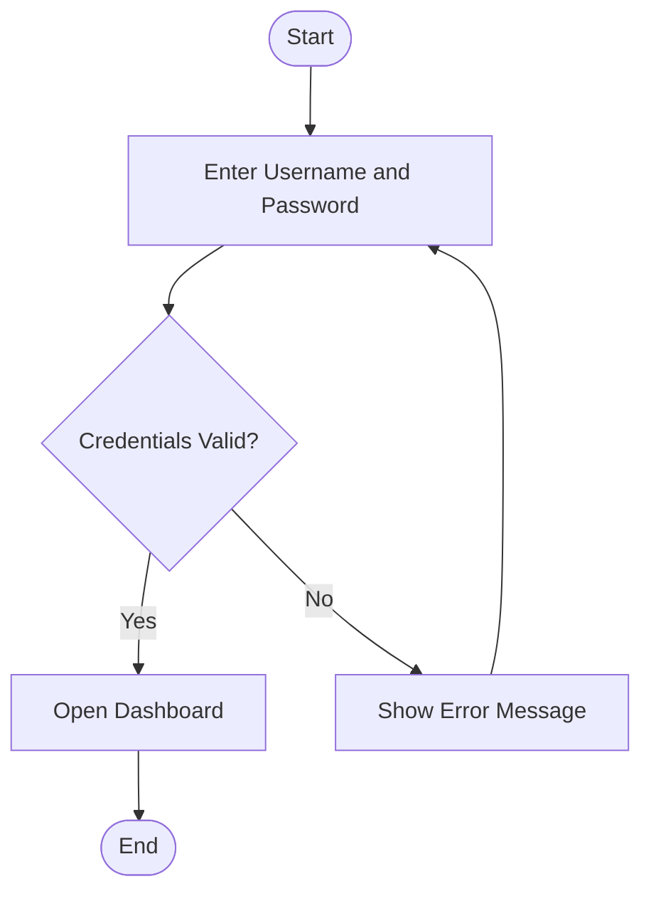

இந்த pattern login, validation, approval போன்ற flow-களுக்கு மிகவும் common.

---

# 9. Multiple Branches

ஒரே decision-ல் 2 மட்டும் அல்லாமல் பல branches இருக்கலாம்.

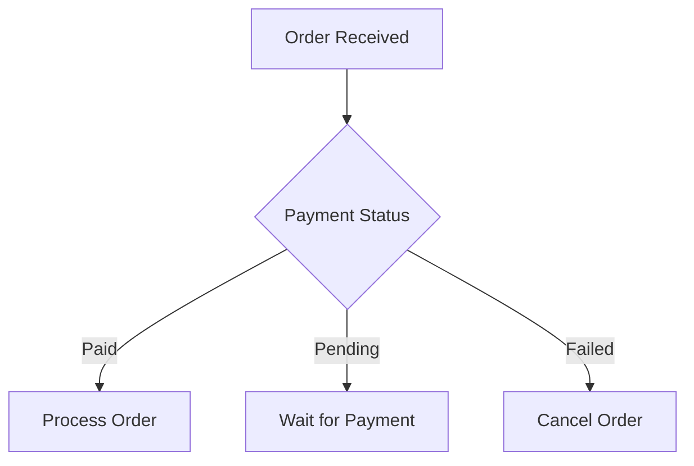

---

# 10. One Node → Multiple Nodes

```mermaid
flowchart TD
    A[Data Loaded]

    A --> B[Create Report]
    A --> C[Run Validation]
    A --> D[Save Audit Log]
```

---

# 11. Multiple Nodes → One Node

```mermaid
flowchart TD
    A[Source 1] --> D[Merge Data]
    B[Source 2] --> D
    C[Source 3] --> D

    D --> E[Final Dataset]
```

---

# 12. Multiline Text inside Nodes

Use `<br/>`.

```mermaid
flowchart TD
    A["Power BI<br/>Semantic Model"]
    B["BigQuery<br/>Source Tables"]

    B --> A
```

Quotation marks பயன்படுத்துவது safer.

```text
A["Line 1<br/>Line 2"]
```

---

# 13. Special Characters

Node text-ல் brackets, colon, slash போன்ற special characters இருந்தால் double quotes பயன்படுத்தவும்.

```mermaid
flowchart TD
    A["Step 1: Load Data"]
    B["Filter: Status = Active"]
    C["Output / Result"]

    A --> B --> C
```

---

# 14. Long Flowchart Clean-ஆ எழுதுவது

Bad:

```text
A --> B --> C --> D --> E --> F --> G
```

Readable format:

```mermaid
flowchart TD
    A[Start]
    B[Read File]
    C[Validate]
    D[Transform]
    E[Load]
    F[Refresh]
    G[End]

    A --> B
    B --> C
    C --> D
    D --> E
    E --> F
    F --> G
```

Large project-ல் second style maintain செய்ய easy.

---

# 15. Subgraph

Related steps-ஐ group செய்ய `subgraph` பயன்படுத்தலாம்.

Syntax:

```text
subgraph GroupName
    ...
end
```

Example:

```mermaid
flowchart LR

    subgraph Source
        A[(BigQuery)]
        B[(Excel)]
    end

    subgraph Processing
        C[Power Query]
        D[Transform Data]
    end

    subgraph Reporting
        E[Semantic Model]
        F[Power BI Report]
    end

    A --> C
    B --> C
    C --> D
    D --> E
    E --> F
```

---

# 16. Subgraph Title with Spaces

```mermaid
flowchart LR

    subgraph S1["Data Sources"]
        A[(BigQuery)]
        B[(SQL Server)]
    end

    subgraph S2["Power BI Layer"]
        C[Power Query]
        D[Semantic Model]
    end

    A --> C
    B --> C
    C --> D
```

---

# 17. Direction inside Subgraph

Main chart direction வேறு, subgraph direction வேறு இருக்கலாம்.

```mermaid
flowchart LR

    subgraph ETL["ETL Process"]
        direction TB
        A[Extract]
        B[Transform]
        C[Load]

        A --> B --> C
    end

    D[(Source)] --> A
    C --> E[(Warehouse)]
```

---

# 18. Nested Subgraphs

Subgraph உள்ளே subgraph உருவாக்கலாம்.

```mermaid
flowchart LR

    subgraph Platform["Analytics Platform"]

        subgraph Data["Data Layer"]
            A[(BigQuery)]
            B[(SQL Server)]
        end

        subgraph BI["BI Layer"]
            C[Power Query]
            D[Power BI Model]
        end

    end

    A --> C
    B --> C
    C --> D
```

---

# 19. Styling a Node

Basic inline style:

```text
style A fill:#f9f,stroke:#333,stroke-width:2px
```

Example:

```mermaid
flowchart LR
    A[Start] --> B[Process] --> C[End]

    style A fill:#d4edda,stroke:#198754,stroke-width:2px
    style B fill:#fff3cd,stroke:#ffc107,stroke-width:2px
    style C fill:#f8d7da,stroke:#dc3545,stroke-width:2px
```

---

# 20. Text Color

```text
color:#000
```

Example:

```mermaid
flowchart LR
    A[Important Step]

    style A fill:#222,stroke:#555,color:#fff
```

---

# 21. classDef — Reusable Styles

Repeated styling-க்கு `classDef` best.

```mermaid
flowchart TD
    A([Start])
    B[Extract]
    C[Transform]
    D[Load]
    E([End])

    A --> B --> C --> D --> E

    classDef startEnd fill:#d4edda,stroke:#198754,stroke-width:2px
    classDef process fill:#e7f1ff,stroke:#0d6efd,stroke-width:1.5px

    class A,E startEnd
    class B,C,D process
```

---

# 22. Multiple Classes

```mermaid
flowchart TD
    A[Source]
    B[Transform]
    C[Validation]
    D[Output]

    A --> B --> C --> D

    classDef source fill:#e2e3e5,stroke:#6c757d
    classDef process fill:#cfe2ff,stroke:#0d6efd
    classDef check fill:#fff3cd,stroke:#ffc107
    classDef output fill:#d1e7dd,stroke:#198754

    class A source
    class B process
    class C check
    class D output
```

---

# 23. Styling Links

Link styling:

```text
linkStyle 0 stroke-width:3px
```

Link numbers zero-based.

Example:

```mermaid
flowchart LR
    A --> B
    B --> C
    C --> D

    linkStyle 0 stroke-width:4px
    linkStyle 1 stroke-dasharray:5 5
    linkStyle 2 stroke-width:2px
```

Large diagram-ல் link index maintain செய்ய கவனம் வேண்டும்.

---

# 24. Dashed Failure Path

Success and failure path visually differentiate செய்யலாம்.

```mermaid
flowchart TD
    A[Run Validation] --> B{Passed?}
    B -->|Yes| C[Publish]
    B -.->|No| D[Fix Errors]
    D --> A
```

---

# 25. Chained Decisions

```mermaid
flowchart TD
    A([Start]) --> B{User Exists?}

    B -->|No| C[Create User]
    B -->|Yes| D{Active?}

    C --> D

    D -->|Yes| E[Allow Login]
    D -->|No| F[Block Login]

    E --> G([End])
    F --> G
```

---

# 26. Loop

Mermaid-ல் loop create செய்ய node-ஐ earlier node-க்கு connect செய்யலாம்.

```mermaid
flowchart TD
    A[Read Record] --> B{Valid?}
    B -->|Yes| C[Process Record]
    B -->|No| D[Log Error]

    C --> E{More Records?}
    D --> E

    E -->|Yes| A
    E -->|No| F([Finish])
```

---

# 27. Retry Pattern

```mermaid
flowchart TD
    A[Call API] --> B{Success?}

    B -->|Yes| C[Save Response]
    B -->|No| D{Retry Count < 3?}

    D -->|Yes| A
    D -->|No| E[Log Failure]
```

---

# 28. Parallel-looking Flow

Mermaid flowchart actual parallel execution engine அல்ல. Diagram-ல் logical parallel branches காட்டலாம்.

```mermaid
flowchart TD
    A[Start Job]

    A --> B[Load Customers]
    A --> C[Load Orders]
    A --> D[Load Products]

    B --> E[Merge]
    C --> E
    D --> E

    E --> F[Create Dataset]
```

---

# 29. ETL Flow Example

```mermaid
flowchart LR

    subgraph Sources["Source Systems"]
        A[(BigQuery)]
        B[(Excel Files)]
        C[(API)]
    end

    subgraph ETL["ETL / Transformation"]
        D[Extract]
        E[Clean]
        F[Transform]
        G[Merge]
    end

    subgraph BI["Reporting"]
        H[Semantic Model]
        I[Power BI Report]
        J[Dashboard]
    end

    A --> D
    B --> D
    C --> D

    D --> E --> F --> G
    G --> H --> I --> J
```

---

# 30. Power BI Refresh Flow

```mermaid
flowchart TD

    A[(BigQuery)] --> B[Power Query]
    B --> C[Transformations]
    C --> D{Data Valid?}

    D -->|No| E[Fix Transformation]
    E --> B

    D -->|Yes| F[Load to Power BI Model]
    F --> G[Relationships]
    G --> H[DAX Measures]
    H --> I[Report Visuals]
    I --> J[Publish to Service]
    J --> K[Scheduled Refresh]
```

---

# 31. Software Development Flow

```mermaid
flowchart TD
    A[Requirement] --> B[Design]
    B --> C[Development]
    C --> D[Unit Testing]
    D --> E{Passed?}

    E -->|No| C
    E -->|Yes| F[UAT]

    F --> G{Approved?}
    G -->|No| C
    G -->|Yes| H[Production Deployment]
```

---

# 32. Approval Workflow

```mermaid
flowchart TD
    A[Employee Request] --> B[Manager Review]

    B --> C{Approved?}

    C -->|No| D[Reject Request]
    C -->|Yes| E[Finance Review]

    E --> F{Budget Available?}

    F -->|No| G[Hold Request]
    F -->|Yes| H[Final Approval]

    H --> I[Process Request]
```

---

# 33. Clickable Nodes

Certain Mermaid renderers support `click`.

```mermaid
flowchart LR
    A[GitHub]
    B[Documentation]

    A --> B

    click A "https://github.com" "Open GitHub"
    click B "https://mermaid.js.org" "Open Mermaid Docs"
```

> Note: Security settings / Markdown platform காரணமாக clickable links சில இடங்களில் disable ஆகலாம்.

---

# 34. Comments inside Mermaid

Mermaid comments:

```text
%% This is a comment
```

Example:

```mermaid
flowchart TD
    %% Start node
    A[Start]

    %% Processing node
    B[Process]

    A --> B
```

---

# 35. Better Node Naming Convention

Small chart:

```text
A, B, C
```

Large chart:

```text
SRC_BQ
ETL_CLEAN
ETL_MERGE
PBI_MODEL
PBI_REPORT
```

Example:

```mermaid
flowchart LR
    SRC_BQ[(BigQuery)]
    ETL_CLEAN[Clean Data]
    ETL_MERGE[Merge Tables]
    PBI_MODEL[Semantic Model]
    PBI_REPORT[Report]

    SRC_BQ --> ETL_CLEAN
    ETL_CLEAN --> ETL_MERGE
    ETL_MERGE --> PBI_MODEL
    PBI_MODEL --> PBI_REPORT
```

Readable IDs பெரிய project-க்கு மிகவும் useful.

---

# 36. Semantic Grouping Pattern

```mermaid
flowchart LR

    subgraph Input["1. Input"]
        SRC1[(Source A)]
        SRC2[(Source B)]
    end

    subgraph Processing["2. Processing"]
        P1[Extract]
        P2[Validate]
        P3[Transform]
    end

    subgraph Output["3. Output"]
        OUT1[(Data Warehouse)]
        OUT2[Dashboard]
    end

    SRC1 --> P1
    SRC2 --> P1
    P1 --> P2 --> P3
    P3 --> OUT1 --> OUT2
```

---

# 37. Numbered Process Flow

```mermaid
flowchart TD
    A["1. Receive Request"]
    B["2. Validate Request"]
    C["3. Process Data"]
    D["4. Verify Output"]
    E["5. Publish Result"]

    A --> B --> C --> D --> E
```

Documentation-க்கு numbered flow useful.

---

# 38. Error Handling Flow

```mermaid
flowchart TD
    A[Start Process] --> B[Execute Task]
    B --> C{Error?}

    C -->|No| D[Continue]
    C -->|Yes| E[Capture Error]

    E --> F[Write Log]
    F --> G{Recoverable?}

    G -->|Yes| B
    G -->|No| H[Stop Process]

    D --> I[Finish]
```

---

# 39. API Integration Flow

```mermaid
flowchart LR

    A[Client App] --> B[API Request]
    B --> C{Authenticated?}

    C -->|No| D[401 Unauthorized]
    C -->|Yes| E[Validate Payload]

    E --> F{Valid?}
    F -->|No| G[400 Bad Request]
    F -->|Yes| H[Business Logic]

    H --> I[(Database)]
    I --> J[API Response]
    J --> A
```

---

# 40. Database / Application Architecture Flow

```mermaid
flowchart LR

    USER[User]
    APP[Web / Mobile App]
    API[Backend API]
    DB[(Database)]
    CACHE[(Cache)]
    REPORT[Reporting Layer]

    USER --> APP
    APP --> API

    API --> DB
    API --> CACHE

    DB --> REPORT
```

---

# 41. Complex Data Platform Example

```mermaid
flowchart LR

    subgraph GCP["Google Cloud"]
        BQ[(BigQuery)]
        GCS[(Cloud Storage)]
    end

    subgraph Fabric["Microsoft Fabric"]
        NB[Notebook]
        LH[(Lakehouse)]
        SM[Semantic Model]
    end

    subgraph PowerBI["Power BI"]
        RPT[Reports]
        APP[Power BI App]
    end

    BQ --> NB
    GCS --> NB

    NB --> LH
    LH --> SM

    SM --> RPT
    RPT --> APP
```

---

# 42. Status-based Flow

```mermaid
flowchart TD
    A[New Ticket] --> B[In Progress]
    B --> C{Resolved?}

    C -->|No| B
    C -->|Yes| D[Resolved]

    D --> E{User Confirmed?}

    E -->|Yes| F[Closed]
    E -->|No| B
```

---

# 43. Using Unicode Symbols

You can use simple Unicode characters inside labels.

```mermaid
flowchart LR
    A["✓ Validation Passed"]
    B["⚠ Warning"]
    C["✕ Failed"]

    A --> B --> C
```

> Emoji rendering depends on font/platform support.

---

# 44. Line Break + Rich Labels

```mermaid
flowchart TD
    A["Source<br/>BigQuery"]
    B["Transformation<br/>Power Query"]
    C["Model<br/>Power BI"]
    D["Output<br/>Dashboard"]

    A --> B --> C --> D
```

---

# 45. Layout Control Tips

Mermaid auto-layout engine தான் node positions decide செய்யும்.

நீங்கள் directly `x`, `y` position கொடுக்க முடியாது.

Layout improve செய்ய:

1. Correct direction (`TD` / `LR`) choose செய்யவும்.
2. Related nodes-ஐ `subgraph`-ல் group செய்யவும்.
3. Unnecessary cross-links குறைக்கவும்.
4. Long labels reduce செய்யவும்.
5. Logical order-ல் connections எழுதவும்.
6. Large diagram-ஐ multiple diagrams-ஆ split செய்யவும்.

---

# 46. TD vs LR எப்போது பயன்படுத்துவது?

## TD

Use when:

- Approval flows
- Decision flows
- Step-by-step process
- Workflow documentation

```mermaid
flowchart TD
    A --> B --> C --> D
```

## LR

Use when:

- Architecture
- Data pipelines
- System integrations
- Source → Processing → Output

```mermaid
flowchart LR
    A --> B --> C --> D
```

---

# 47. Advanced Styling with classDef

```mermaid
flowchart TD

    A([Start])
    B[Load Data]
    C{Validation Passed?}
    D[Transform]
    E[Log Error]
    F[(Warehouse)]
    G([End])

    A --> B
    B --> C

    C -->|Yes| D
    C -->|No| E

    E --> B
    D --> F
    F --> G

    classDef startEnd fill:#d1e7dd,stroke:#198754,stroke-width:2px
    classDef process fill:#cfe2ff,stroke:#0d6efd,stroke-width:1.5px
    classDef decision fill:#fff3cd,stroke:#ffc107,stroke-width:2px
    classDef error fill:#f8d7da,stroke:#dc3545,stroke-width:2px
    classDef database fill:#e2e3e5,stroke:#6c757d,stroke-width:1.5px

    class A,G startEnd
    class B,D process
    class C decision
    class E error
    class F database
```

---

# 48. Theme Initialization

Some Mermaid renderers support init configuration.

```text
%%{init: {'theme':'base'}}%%
```

Example:

````markdown
```mermaid
%%{init: {'theme':'base'}}%%
flowchart LR
    A[Source] --> B[Process] --> C[Output]
```
````

Common themes may include:

- `default`
- `neutral`
- `dark`
- `forest`
- `base`

Support platform/version பொறுத்து மாறலாம்.

---

# 49. Theme Variables

Advanced configuration:

````markdown
```mermaid
%%{init: {
  "theme": "base",
  "themeVariables": {
    "primaryColor": "#E7F1FF",
    "primaryBorderColor": "#0D6EFD",
    "primaryTextColor": "#111111"
  }
}}%%
flowchart LR
    A[Source] --> B[Process] --> C[Output]
```
````

இந்த syntax Mermaid version/platform support-ஐ பொறுத்தது.

---

# 50. Common Errors

## Error 1 — Missing `end`

Wrong:

```text
subgraph Data
    A --> B
```

Correct:

```text
subgraph Data
    A --> B
end
```

---

## Error 2 — Duplicate Meaningful IDs

Technically same ID reused என்றால் same node தான்.

```text
A[Start]
A[Finish]
```

இது இரண்டு nodes இல்லை.

Better:

```text
START[Start]
END[Finish]
```

---

## Error 3 — Special Characters Breaking Syntax

Instead of:

```text
A[Status = A/B (Current)]
```

Use:

```text
A["Status = A/B (Current)"]
```

---

## Error 4 — Huge Diagram

100 nodes ஒரே flowchart-ல் போட்டால் readability குறையும்.

Better:

- High-level architecture
- Detailed ETL
- Detailed approval
- Detailed error handling

என்று separate charts.

---

# 51. Recommended Shape Convention

Consistent notation documentation-ஐ professional-ஆ காட்டும்.

| Meaning | Suggested Shape |
|---|---|
| Start / End | `([ ])` |
| Process | `[ ]` |
| Decision | `{ }` |
| Database | `[( )]` |
| Input / Output | `[/ /]` |
| External System | `[[ ]]` or normal rectangle |
| Group | `subgraph` |

Example:

```mermaid
flowchart TD
    START([Start])
    INPUT[/User Input/]
    PROCESS[Process Request]
    CHECK{Valid?}
    DB[(Database)]
    END([End])

    START --> INPUT
    INPUT --> PROCESS
    PROCESS --> CHECK

    CHECK -->|Yes| DB
    CHECK -->|No| INPUT

    DB --> END
```

---

# 52. Reusable Template — Simple Process

Copy this:

````markdown
```mermaid
flowchart TD

    START([Start])
    STEP1[Step 1]
    STEP2[Step 2]
    CHECK{Condition?}
    SUCCESS[Success]
    FAILURE[Failure]
    END([End])

    START --> STEP1
    STEP1 --> STEP2
    STEP2 --> CHECK

    CHECK -->|Yes| SUCCESS
    CHECK -->|No| FAILURE

    SUCCESS --> END
    FAILURE --> END
```
````

---

# 53. Reusable Template — Data Pipeline

````markdown
```mermaid
flowchart LR

    subgraph Sources["Sources"]
        SRC1[(Source 1)]
        SRC2[(Source 2)]
    end

    subgraph Processing["Processing"]
        EXT[Extract]
        VAL[Validate]
        TRN[Transform]
    end

    subgraph Output["Output"]
        DB[(Data Store)]
        RPT[Report]
    end

    SRC1 --> EXT
    SRC2 --> EXT

    EXT --> VAL
    VAL --> TRN

    TRN --> DB
    DB --> RPT
```
````

---

# 54. Reusable Template — Approval

````markdown
```mermaid
flowchart TD

    START([Request Created])
    REVIEW[Manager Review]
    DECISION{Approved?}
    APPROVED[Process Request]
    REJECTED[Reject Request]
    END([Close])

    START --> REVIEW
    REVIEW --> DECISION

    DECISION -->|Yes| APPROVED
    DECISION -->|No| REJECTED

    APPROVED --> END
    REJECTED --> END
```
````

---

# 55. Reusable Template — Retry/Error Handling

````markdown
```mermaid
flowchart TD

    START([Start])
    RUN[Run Process]
    CHECK{Success?}
    SAVE[Save Result]
    RETRY{Retries Left?}
    LOG[Log Failure]
    END([End])

    START --> RUN
    RUN --> CHECK

    CHECK -->|Yes| SAVE
    CHECK -->|No| RETRY

    RETRY -->|Yes| RUN
    RETRY -->|No| LOG

    SAVE --> END
    LOG --> END
```
````

---

# 56. Professional Flowchart Example

```mermaid
flowchart LR

    subgraph SourceLayer["Source Layer"]
        ERP[(ERP)]
        CRM[(CRM)]
        FILES[(Files)]
    end

    subgraph DataLayer["Data Processing Layer"]
        INGEST[Data Ingestion]
        VALIDATE{Validation}
        TRANSFORM[Transformation]
        DWH[(Data Warehouse)]
    end

    subgraph AnalyticsLayer["Analytics Layer"]
        MODEL[Semantic Model]
        REPORT[Power BI Report]
        APP[Power BI App]
    end

    ERP --> INGEST
    CRM --> INGEST
    FILES --> INGEST

    INGEST --> VALIDATE

    VALIDATE -->|Passed| TRANSFORM
    VALIDATE -.->|Failed| ERROR[Error Log]

    ERROR --> INGEST

    TRANSFORM --> DWH
    DWH --> MODEL
    MODEL --> REPORT
    REPORT --> APP

    classDef source fill:#e2e3e5,stroke:#6c757d
    classDef process fill:#cfe2ff,stroke:#0d6efd
    classDef decision fill:#fff3cd,stroke:#ffc107
    classDef output fill:#d1e7dd,stroke:#198754
    classDef error fill:#f8d7da,stroke:#dc3545

    class ERP,CRM,FILES source
    class INGEST,TRANSFORM process
    class VALIDATE decision
    class DWH,MODEL,REPORT,APP output
    class ERROR error
```

---

# 57. Advanced Example — Full Data Refresh Workflow

```mermaid
flowchart TD

    START([Scheduled Refresh Starts])

    CHECK_SOURCE{Source Available?}

    EXTRACT[Extract Data]
    VALIDATE_SCHEMA{Schema Valid?}
    TRANSFORM[Transform Data]
    QUALITY{Quality Checks Passed?}

    LOAD[Load Dataset]
    REFRESH[Refresh Semantic Model]
    PUBLISH[Update Reports]

    SOURCE_ERR[Log Source Error]
    SCHEMA_ERR[Log Schema Error]
    QUALITY_ERR[Log Data Quality Error]

    RETRY{Retry Allowed?}
    NOTIFY[Send Failure Notification]

    SUCCESS([Refresh Completed])
    FAILURE([Refresh Failed])

    START --> CHECK_SOURCE

    CHECK_SOURCE -->|Yes| EXTRACT
    CHECK_SOURCE -->|No| SOURCE_ERR

    EXTRACT --> VALIDATE_SCHEMA

    VALIDATE_SCHEMA -->|Yes| TRANSFORM
    VALIDATE_SCHEMA -->|No| SCHEMA_ERR

    TRANSFORM --> QUALITY

    QUALITY -->|Yes| LOAD
    QUALITY -->|No| QUALITY_ERR

    LOAD --> REFRESH
    REFRESH --> PUBLISH
    PUBLISH --> SUCCESS

    SOURCE_ERR --> RETRY
    SCHEMA_ERR --> RETRY
    QUALITY_ERR --> RETRY

    RETRY -->|Yes| START
    RETRY -->|No| NOTIFY

    NOTIFY --> FAILURE

    classDef startEnd fill:#d1e7dd,stroke:#198754,stroke-width:2px
    classDef process fill:#cfe2ff,stroke:#0d6efd
    classDef decision fill:#fff3cd,stroke:#ffc107,stroke-width:2px
    classDef error fill:#f8d7da,stroke:#dc3545
    classDef success fill:#d1e7dd,stroke:#198754

    class START,SUCCESS startEnd
    class CHECK_SOURCE,VALIDATE_SCHEMA,QUALITY,RETRY decision
    class EXTRACT,TRANSFORM,LOAD,REFRESH,PUBLISH process
    class SOURCE_ERR,SCHEMA_ERR,QUALITY_ERR,NOTIFY,FAILURE error
```

---

# 58. Mermaid Flowchart Best Practices

1. `TD` — business/process flow.
2. `LR` — architecture/data pipeline.
3. Node IDs meaningful-ஆ வைத்துக்கொள்ளவும்.
4. Decision nodes-க்கு `{}` பயன்படுத்தவும்.
5. Arrow labels-ல் `Yes`, `No`, `Success`, `Failure` போன்ற clear text பயன்படுத்தவும்.
6. Related sections-க்கு `subgraph` பயன்படுத்தவும்.
7. 3–5 consistent styles மட்டும் பயன்படுத்தவும்.
8. Very long text nodes avoid செய்யவும்.
9. Error/retry path-ஐ dotted arrow மூலம் differentiate செய்யலாம்.
10. Large flow-ஐ multiple diagrams ஆக split செய்யவும்.
11. Start/End shape consistent வைத்துக்கொள்ளவும்.
12. Documentation-ல் diagram கீழே short explanation சேர்க்கவும்.

---

# 59. Quick Reference Cheat Sheet

## Direction

```text
flowchart TD
flowchart LR
flowchart RL
flowchart BT
```

## Shapes

```text
A[Rectangle]
A(Rounded)
A([Stadium])
A((Circle))
A{Decision}
A{{Hexagon}}
A[(Database)]
A[/Input/]
```

## Links

```text
A --> B
A --- B
A -.-> B
A ==> B
A -->|Yes| B
A -- Yes --> B
```

## Subgraph

```text
subgraph NAME["Title"]
    A --> B
end
```

## Style

```text
style A fill:#fff,stroke:#000
```

## Reusable Style

```text
classDef process fill:#cfe2ff,stroke:#0d6efd
class A,B,C process
```

## Comment

```text
%% Comment
```

---

# 60. Practice Exercises

## Exercise 1

Create:

```text
Start
  ↓
Login
  ↓
Credentials Valid?
 ↙         ↘
No         Yes
↓           ↓
Error    Dashboard
```

---

## Exercise 2

Create a flow:

```text
BigQuery
Excel
API
  ↓
Power Query
  ↓
Transformation
  ↓
Power BI Model
  ↓
Dashboard
```

Use `subgraph` for Sources and Reporting.

---

## Exercise 3

Create:

```text
Order
 ↓
Payment
 ↓
Payment Successful?
  ├─ No → Retry → Payment
  └─ Yes → Ship Order → Delivered
```

---

## Exercise 4 — Advanced

Design a complete software release flow:

```text
Requirement
→ Development
→ Unit Test
→ Code Review
→ QA
→ UAT
→ Production
```

Every testing stage should have:

- Pass
- Fail
- Retry / Fix loop

---

# 61. Final Learning Path

Mermaid Flowchart-ஐ இந்த order-ல் practice செய்யவும்:

### Level 1 — Basic

- `flowchart TD`
- Nodes
- `-->`
- Rectangle
- Decision

### Level 2 — Intermediate

- Labels
- Multiple branches
- Loops
- Subgraphs
- Database shapes
- `LR` layouts

### Level 3 — Advanced

- `classDef`
- Styling
- Nested subgraphs
- Error-handling patterns
- Large system diagrams
- Architecture diagrams

### Level 4 — Professional Usage

- Consistent node naming
- Reusable style system
- Separate business/data/system flows
- Documentation-friendly diagrams
- GitHub repository architecture docs
- Technical design documents

---

# 62. One Complete Template to Keep

இந்த template-ஐ copy செய்து உங்கள் project-க்கு modify செய்யலாம்.

````markdown
```mermaid
flowchart LR

    subgraph Sources["Data Sources"]
        SRC1[(Source 1)]
        SRC2[(Source 2)]
        SRC3[(Source 3)]
    end

    subgraph Processing["Processing Layer"]
        INGEST[Ingestion]
        VALIDATE{Validation Passed?}
        TRANSFORM[Transformation]
        ERROR[Error Log]
    end

    subgraph Analytics["Analytics Layer"]
        STORE[(Data Store)]
        MODEL[Semantic Model]
        REPORT[Dashboard]
    end

    SRC1 --> INGEST
    SRC2 --> INGEST
    SRC3 --> INGEST

    INGEST --> VALIDATE

    VALIDATE -->|Yes| TRANSFORM
    VALIDATE -.->|No| ERROR

    ERROR --> INGEST

    TRANSFORM --> STORE
    STORE --> MODEL
    MODEL --> REPORT

    classDef source fill:#e2e3e5,stroke:#6c757d
    classDef process fill:#cfe2ff,stroke:#0d6efd
    classDef decision fill:#fff3cd,stroke:#ffc107
    classDef error fill:#f8d7da,stroke:#dc3545
    classDef output fill:#d1e7dd,stroke:#198754

    class SRC1,SRC2,SRC3 source
    class INGEST,TRANSFORM process
    class VALIDATE decision
    class ERROR error
    class STORE,MODEL,REPORT output
```
````

---

# 63. Final Note

Mermaid Flowchart கற்றுக்கொள்ள முக்கியமானது syntax memorize செய்வது அல்ல.

இந்த 5 concepts புரிந்தால் போதும்:

```text
Node
Connection
Decision
Grouping
Styling
```

அதற்கு பிறகு எந்த business process, data pipeline, software architecture, approval workflow, Power BI refresh flow இருந்தாலும் diagram-ஆ convert செய்ய முடியும்.

---

## Mini Cheat Sheet

```mermaid
flowchart TD

    START([Start])
    PROCESS[Process]
    DECISION{Condition?}
    SUCCESS[Success]
    ERROR[Error]
    END([End])

    START --> PROCESS
    PROCESS --> DECISION

    DECISION -->|Yes| SUCCESS
    DECISION -.->|No| ERROR

    SUCCESS --> END
    ERROR --> PROCESS
```

**Start → Process → Decision → Branch → Loop → End**

இதுதான் Mermaid Flowchart-ன் core.
