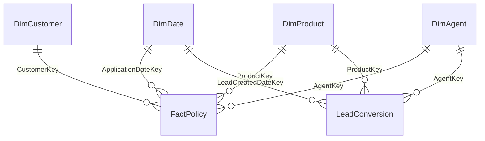

# Relationship Model

The curated data uses a Power BI-friendly star schema. All relationships should be single-direction from dimension to fact unless a specific report requirement proves otherwise.

## Power BI relationships

| From | To | Cardinality | Active | Use |
| --- | --- | --- | --- | --- |
| `DimDate[DateKey]` | `FactPolicy[ApplicationDateKey]` | 1:* | Yes | Application/new-policy analysis |
| `DimDate[DateKey]` | `FactPolicy[IssueDateKey]` | 1:* | No | Issue-date measures via `USERELATIONSHIP()` |
| `DimDate[DateKey]` | `FactPolicy[RenewalDateKey]` | 1:* | No | Renewal-date measures via `USERELATIONSHIP()` |
| `DimCustomer[CustomerKey]` | `FactPolicy[CustomerKey]` | 1:* | Yes | Customer and geography analysis |
| `DimProduct[ProductKey]` | `FactPolicy[ProductKey]` | 1:* | Yes | Product performance |
| `DimAgent[AgentKey]` | `FactPolicy[AgentKey]` | 1:* | Yes | Agent/channel policy performance |
| `DimDate[DateKey]` | `LeadConversion[LeadCreatedDateKey]` | 1:* | Yes | Lead trends |
| `DimProduct[ProductKey]` | `LeadConversion[ProductKey]` | 1:* | Yes | Product-interest conversion |
| `DimAgent[AgentKey]` | `LeadConversion[AgentKey]` | 1:* | Yes | Agent/channel lead performance |

`LeadPropensity` is a scored Gold output. Relate it to `DimProduct` and `DimAgent` by their keys. Keep `LeadID` unique in the scored table and use it to retrieve lead-level attributes when needed.

## Date behavior

The active policy date is application date. Measures requiring issue or renewal context should activate the relevant inactive relationship. `DimDate` includes a 366-day future buffer solely to preserve valid first-renewal keys for policies issued near the demo end date.

## Modeling notes

- Keep `PolicyID`, `CustomerID`, `AgentID` and `LeadID` as text identifiers.
- Hide surrogate keys from report view after relationships are configured.
- Mark `DimDate` as the model's date table using `DimDate[Date]`.
- Use measures for premiums, rates and counts; avoid repeated calculated columns.
- Latitude/longitude values are planning-area or branch centroids, never household coordinates.
- `LeadConversion` outcomes are blank for open leads. Use `LeadPropensity` for open-lead scores.
